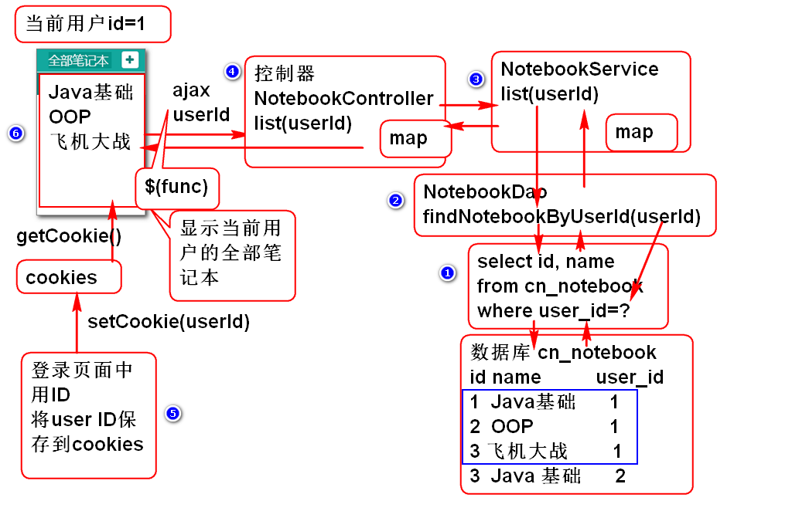
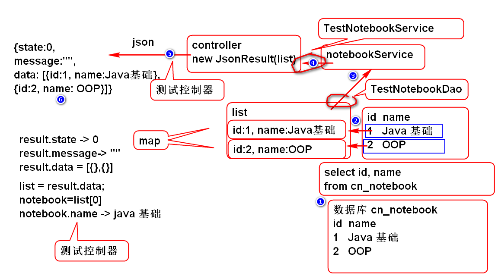

# 云笔记

## 设计思路总结:

软件功能总体思路:

	程序 = 数据结构 +　算法

软件功能实现实例: 

注册:

1. 业务功能
	- 保存用注册的信息
2. 数据如何储存
	- cn_user
3. 如何操作数据
	- insert into cn_user ...
4. 如何利用程序完成数据操作
	- 编程: 将用户输入的数据存储到数据库
	- ajax: 读取用户输入数据发送到服务器
	- 业务层:　完成软件的业务功能
	- 数据层: 完成数据访问功能 

## 笔记本列表功能

思路分析: 显示当前登录用户的全部笔记本

1. 测试数据操作语句

		//利用Eclipse 或者 SQL Developer 测试SQL

		select cn_user_id
			from cn_notebook;
		
		select 
			cn_notebook_id as id,
			cn_notebook_name as name
		from 
			cn_notebook
		where 
			cn_user_id='333c6d0b-e4a2-4596-9902-a5d98c2f665a';

2. 实现数据持久层
		
	1. 添加数据层接口方法

			public interface NotebookDao {
				
				/**
				 * 根据用户的ID查找这个用户的全部笔记本信息 
				 * @param userId 用户ID
				 * @return 笔记本信息列表, 每个笔记本信息包含id和name属性
				 */
				List<Map<String, Object>> findNotebookByUserId(
						String userId);
				
			}

	2. 添加数据层SQL Mapper
	
			<?xml version="1.0" encoding="UTF-8" ?>  
			<!DOCTYPE mapper PUBLIC "-//ibatis.apache.org//DTD Mapper 3.0//EN"      
			 "http://ibatis.apache.org/dtd/ibatis-3-mapper.dtd">
			
			<mapper namespace="cn.tedu.cloudnote.dao.NotebookDao">
				<select id="findNotebookByUserId"
					parameterType="string"
					resultType="map"> 
					select 
						cn_notebook_id as id,
						cn_notebook_name as name
					from 
						cn_notebook
					where 
						cn_user_id=#{userId}
				</select>
			</mapper>

		> 提示: SQL 语句来自步骤1

	3. 测试

			public class TestCaseBase {
			
				protected ClassPathXmlApplicationContext ctx;
			
				public TestCaseBase() {
					super();
				}
			
				@Before
				public void initCtx() {
					ctx=new ClassPathXmlApplicationContext(
						"conf/spring-mybatis.xml",
						"conf/spring-mvc.xml");
				}
			
			}
			
			public class TestNotebookDao extends TestCaseBase {
				NotebookDao dao;
				@Before
				public void initDao(){
					dao = ctx.getBean(
					"notebookDao", NotebookDao.class);
				}
				@Test
				public void testFindNotebookByUserId(){
					String userId="333c6d0b-e4a2-4596-9902-a5d98c2f665a";
					List<Map<String, Object>> list=
						dao.findNotebookByUserId(userId);
					for (Map<String, Object> map : list) {
						System.out.println(map); 
					}
				}
			}
	

3. 业务层实现
	1. 编写业务层接口

			public interface NotebookService {
				/**
				 * 根据用户ID查询笔记本列表 
				 * @param userId 用户ID
				 * @return 笔记本列表, 每个笔记本信息包含ID和name
				 * @throws UserNotFoundException 用户ID不存在时候
				 *   抛出异常
				 */
				List<Map<String, Object>> listNotebooks(
						String userId) 
						throws UserNotFoundException;
			}

	2. 实现业务层接口

			@Service("notebookService")
			public class NotebookServiceImpl 
				implements NotebookService {
			
				@Resource //注入数据层 
				private NotebookDao notebookDao;
				
				@Resource
				private UserDao userDao;
				
				public List<Map<String, Object>> 
					listNotebooks(String userId) 
					throws UserNotFoundException {
					if(userId==null || userId.trim().isEmpty()){
						throw new UserNotFoundException("ID空");
					}
					User user = userDao.findUserById(userId);
					if(user==null){
						throw new UserNotFoundException("ID不存在");
					}
					return notebookDao.findNotebookByUserId(userId); 
				}
			}

	3. 重构 UserDao 添加方法:

			User findUserById(String userId);
	
	4. 添加SQL UserMapper.xml:

			<select id="findUserById"
				parameterType="string"
				resultType="cn.tedu.cloudnote.entity.User">
				select
						cn_user_id as id,
						cn_user_name as name,
						cn_user_password as password,
						cn_user_token as token,
						cn_user_nick as nick
				from	
						cn_user
				where
						cn_user_id=#{userId}
			</select>
		
	
	5. 测试:

			public class TestNotebookService 
				extends TestCaseBase{
				
				NotebookService service;
				
				@Before
				public void initService(){
					service = ctx.getBean("notebookService",
						NotebookService.class);
				}
				
				@Test
				public void testListNotebooks(){
					String userId="333c6d0b-e4a2-4596-9902-a5d98c2f665a";
					List<Map<String, Object>> list=
						service.listNotebooks(userId);
					for (Map<String, Object> map : list) {
						System.out.println(map);
					}
				}
			}

4. 控制器实现

	1. 添加BaseController 封装异常处理方法:

			public abstract class BaseController {
			
				@ExceptionHandler(Exception.class)
				@ResponseBody
				public JsonResult exceptionHandle(Exception e) {
					//参数e就是被捕获到的异常对象
					e.printStackTrace();
					System.out.println("exceptionHandle");
					return new JsonResult(e);
				}
			
			}

	2. 添加控制器 NotebookController

			@Controller
			@RequestMapping("/notebook")
			public class NotebookController extends BaseController {
				
				@Resource
				private NotebookService notebookService;
				
				@RequestMapping("/list.do")
				@ResponseBody
				public JsonResult list(String userId){
					//调用业务层 notebookService
					List<Map<String, Object>> list=
						notebookService.listNotebooks(userId);
					return new JsonResult(list);
				}
				
			}

	3. 部署测试:

			http://localhost:8080/cloudnote/notebook/list.do

			http://localhost:8080/cloudnote/notebook/list.do?userId=333c6d0b-e4a2-4596-9902-a5d98c2f665a

	4. 重构UserController, 利用异常处理注解处理异常

			@Controller
			@RequestMapping("/user")
			public class UserController extends BaseController {
				@Resource
				private UserService userService;
				@ResponseBody
				@RequestMapping("/login.do")
				public Object login(String name,String password){
					User user
						=userService.Login(name, password);
					return new JsonResult(user);
				}
				
				@ExceptionHandler(NameException.class)
				@ResponseBody
				public JsonResult handleNameExp(NameException e){
					e.printStackTrace();
					return new JsonResult(2, e);
				}
				
				@ExceptionHandler(PasswordException.class)
				@ResponseBody
				public JsonResult handlePwdExp(PasswordException e){
					e.printStackTrace();
					return new JsonResult(3, e);
				}
				
				//用户注册
				@RequestMapping("/regist.do")
				@ResponseBody
				public JsonResult regist(String name,String password,
										 String nick){
					User user
						=userService.regist(name, password, nick);
					return new JsonResult(user);
				}
			}

5. 整合界面

	1. 在edit.html 中添加脚本:

			
			
				

	2. 添加notebook.js在页面启动时候发起ajax请求.
		
			//sctipts/notebook.js
			//网页加载之后执行
			$(function(){
				//调用方法加载笔记本列表
				loadNotebooks();
			});
	
			function loadNotebooks(){
				//请求 notebook/list.do
				//如果成功就将请求结果显示到界面(DOM)上
				var url = 'notebook/list.do';
				var data = {userId:getCookie('userId')};
				console.log(data);
				$.getJSON(url, data, function(result){
					if(result.state==0){
						//console.log(result);
						var list = result.data;
						showNotebooks(list);
					}else{
						alert(result.message);
					}
				});
			}
			
	3. 请求成功以后将数据显示到html界面上
			
			function showNotebooks(list){
				//找到ul对象
				var ul = $('#pc_part_1 .contacts-list');
				ul.empty();
				//为List中每个笔记本对象生成一个li元素, 添加到ul中
				for(var i=0; i<list.length; i++){
					var notebook=list[i];
					var li = notebookTemplate.replace(
							'[name]', notebook.name);
					//将生成的li元素添加到页面的ul元素中
					ul.append(li);
				}
			}
			
			var notebookTemplate=
				'<li class="online">'+
				'<a>'+
				'<i class="fa fa-book" title="online" '+
					' rel="tooltip-bottom">'+
				'</i> [name]</a></li>';

	
	4. 测试: 登录以后会显示笔记本列表

## 笔记本列表数据是如何传递的:

-------------------------

## 作业

1. 实现显示笔记本列表功能
