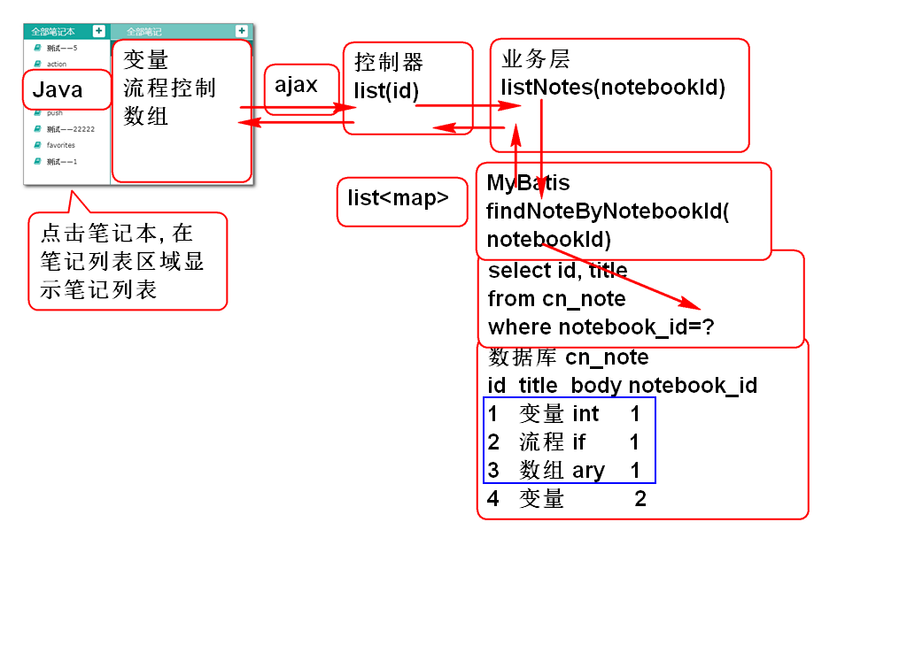
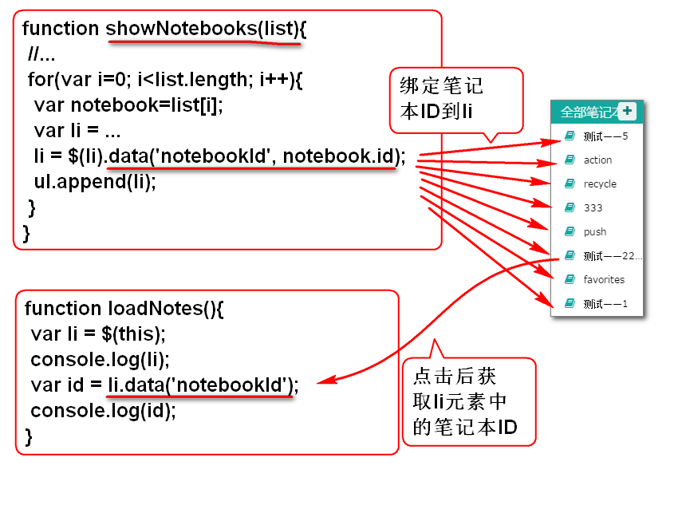
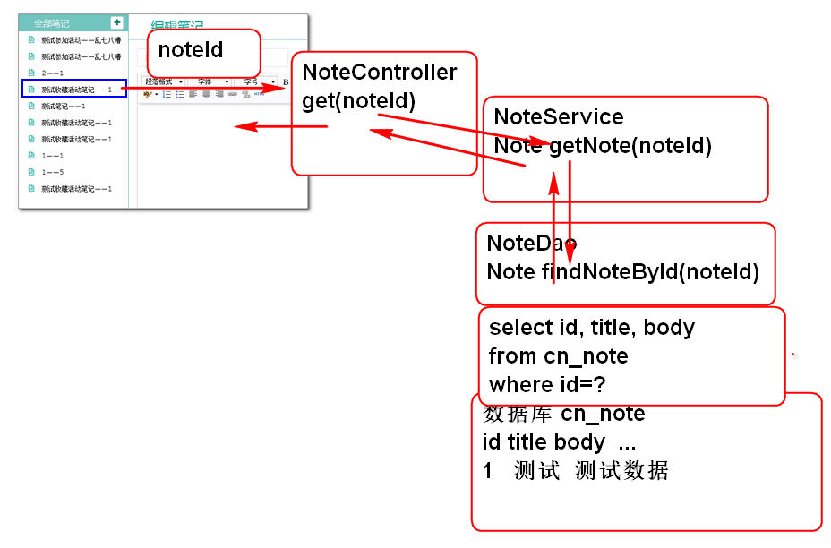

# 云笔记

## 笔记列表功能

实现原理:

### 1. 编写测试SQL

1. 编写SQL查询笔记表中的笔记本ID

		-- 查询笔记本id
		select 
			cn_notebook_id 
		from 
			cn_note

2. 编写查询笔记列表的SQL

		-- 查询笔记列表
		select
			cn_note_id as id,
			cn_note_title as title
		from
			cn_note
		where 
			cn_notebook_id='0b11444a-a6d6-45ff-8d46-282afaa6a655'
		
### 2. 编写数据访问层

1. 编写数据层接口:

		public interface NoteDao {
			
			/**
			 * 查询一个笔记本中的全部笔记信息
			 * @param notebookId
			 * @return 笔记列表, 每个元素包含id和titile
			 */
			List<Map<String, Object>> findNotesByNotebookId(
					String notebookId);
		}

2. 编写Mapper文件

		<?xml version="1.0" encoding="UTF-8" ?>  
		<!DOCTYPE mapper PUBLIC "-//ibatis.apache.org//DTD Mapper 3.0//EN"      
		 "http://ibatis.apache.org/dtd/ibatis-3-mapper.dtd">
		
		<mapper namespace="cn.tedu.cloudnote.dao.NoteDao">	
			<select id="findNotesByNotebookId"
				parameterType="string"
				resultType="map">
				select
					cn_note_id as id,
					cn_note_title as title
				from
					cn_note
				where 
					cn_notebook_id=#{notebookId}
			</select>
		</mapper>	

3. 测试

		public class TestNoteDao extends TestCaseBase{
			NoteDao dao;
			@Before
			public void initDao(){
				dao = ctx.getBean("noteDao", NoteDao.class);
			}
			@Test
			public void testFindNotesByNotebookId(){
				String notebookId="0b11444a-a6d6-45ff-8d46-282afaa6a655";
				List<Map<String, Object>> list=
					dao.findNotesByNotebookId(notebookId);
				for (Map<String, Object> map : list) {
					System.out.println(map);
				}
			}
		}

### 3. 编写业务层

1. 编写业务层接口:

		public interface NoteService {
			/**
			 * 笔记列表功能 
			 * @param notebookId 笔记本ID
			 * @return 笔记本中的笔记列表, 每个笔记对象包含
			 *   id和title两个属性 
			 * @throws NotebookNotFoundException 笔记本不存在
			 *   时候抛出异常 
			 */
			List<Map<String, Object>> listNotes(
					String notebookId)
				throws NotebookNotFoundException;
		}

		//业务异常类
		public class NotebookNotFoundException extends RuntimeException {
			private static final long serialVersionUID = 8937501369306626438L;
		
			public NotebookNotFoundException() {
			}
		
			public NotebookNotFoundException(String message) {
				super(message);
			}
		
			public NotebookNotFoundException(Throwable cause) {
				super(cause);
			}
		
			public NotebookNotFoundException(String message, Throwable cause) {
				super(message, cause);
			}
		
			public NotebookNotFoundException(String message, Throwable cause, boolean enableSuppression,
					boolean writableStackTrace) {
				super(message, cause, enableSuppression, writableStackTrace);
			}
		
		}

2. 实现业务层方法
	
	1. 实现业务层方法
	
			@Service("noteService")
			public class NoteServiceImpl implements NoteService {
			
				@Resource 
				private NoteDao noteDao;
				
				@Resource
				private NotebookDao notebookDao;
				
				public List<Map<String, Object>> 
					listNotes(String notebookId) 
					throws NotebookNotFoundException {
					if(notebookId==null || notebookId.trim().isEmpty()){
						throw new NotebookNotFoundException("Id空");
					}
					Notebook notebook = notebookDao
							.findNotebookById(notebookId);
					if(notebook==null){
						throw new NotebookNotFoundException(
							"笔记本不存在");
					}
					return noteDao.findNotesByNotebookId(notebookId);
				}
			}

	2. 添加实体类 Notebook

			public class Notebook implements Serializable{
				private static final long serialVersionUID = -8341731366267651270L;
				
				private String id;
				private String name;
				private String typeId;
				private String userId;
				private String desc;
				private Timestamp createtime;
				
				public Notebook() {
				}
			
				public Notebook(String id, String name, String typeId, String userId, String desc, Timestamp createtime) {
					super();
					this.id = id;
					this.name = name;
					this.typeId = typeId;
					this.userId = userId;
					this.desc = desc;
					this.createtime = createtime;
				}
			
				public String getId() {
					return id;
				}
			
				public void setId(String id) {
					this.id = id;
				}
			
				public String getName() {
					return name;
				}
			
				public void setName(String name) {
					this.name = name;
				}
			
				public String getTypeId() {
					return typeId;
				}
			
				public void setTypeId(String typeId) {
					this.typeId = typeId;
				}
			
				public String getUserId() {
					return userId;
				}
			
				public void setUserId(String userId) {
					this.userId = userId;
				}
			
				public String getDesc() {
					return desc;
				}
			
				public void setDesc(String desc) {
					this.desc = desc;
				}
			
				public Timestamp getCreatetime() {
					return createtime;
				}
			
				public void setCreatetime(Timestamp createtime) {
					this.createtime = createtime;
				}
			
				@Override
				public String toString() {
					return "Notebook [id=" + id + ", name=" + name + ", typeId=" + typeId + ", userId=" + userId + ", desc=" + desc
							+ ", createtime=" + createtime + "]";
				}
			
				@Override
				public int hashCode() {
					final int prime = 31;
					int result = 1;
					result = prime * result + ((id == null) ? 0 : id.hashCode());
					return result;
				}
			
				@Override
				public boolean equals(Object obj) {
					if (this == obj)
						return true;
					if (obj == null)
						return false;
					if (getClass() != obj.getClass())
						return false;
					Notebook other = (Notebook) obj;
					if (id == null) {
						if (other.id != null)
							return false;
					} else if (!id.equals(other.id))
						return false;
					return true;
				}
			}
	
	2. 添加实体访问接口方法 NotebookDao

			Notebook findNotebookById(String notebookId);
	
	3. 添加SQL NotebookMapper.xml:

			<select id="findNotebookById"
				parameterType="string"
				resultType="cn.tedu.cloudnote.entity.Notebook">
				select 
					cn_notebook_id 			as id,
					cn_user_id 					as userId,
					cn_notebook_type_id 		as typeId,
					cn_notebook_name 			as name,
					cn_notebook_desc 			as "desc",
					cn_notebook_createtime 	as createtime
				from
					cn_notebook
				where 
					cn_notebook_id=#{notebookId}			
			</select>
		
		> 提示: 请先对SQL进行测试, 在复制到XML文件中!

4. 测试

		public class TestNotebookService 
			extends TestCaseBase{
			
			NotebookService service;
			
			@Before
			public void initService(){
				service = ctx.getBean("notebookService",
					NotebookService.class);
			}
			
			@Test
			public void testListNotebooks(){
				String userId="333c6d0b-e4a2-4596-9902-a5d98c2f665a";
				List<Map<String, Object>> list=
					service.listNotebooks(userId);
				for (Map<String, Object> map : list) {
					System.out.println(map);
				}
			}
		}
		
### 4. 编写控制器

1. 编写控制器类:

		@Controller
		@RequestMapping("/note")
		public class NoteController extends BaseController {
			
			@Resource
			private NoteService noteService;
			
			@RequestMapping("/list.do")
			@ResponseBody
			public JsonResult list(String notebookId){
				List<Map<String, Object>> list=
					noteService.listNotes(notebookId);
				return new JsonResult(list);
			}	
		}

2. 部署测试:

		http://localhost:8080/cloudnote/note/list.do?notebookId=0b11444a-a6d6-45ff-8d46-282afaa6a655

		http://localhost:8080/cloudnote/note/list.do?notebookId=0b1

### 5. 编写JS脚步

1. 在ready方法中绑定li点击事件

		//利用事件冒泡,绑定li被点击时候执行事件程序
		//绑定笔记本列表中li元素被点击的事件
		$('#pc_part_1').on('click','li',loadNotes);
	
2. 添加事件处理方法 

		function loadNotes(){
			//在事件方法中的this就是当前发生事件的对象 li
			var li = $(this);
			console.log(li);
			//获取在显示时候绑定到li中的笔记本ID值
			var id = li.data('notebookId');
			console.log(id);
			
			//设置选中高亮效果
			li.parent().find('a').removeClass('checked');
			li.find('a').addClass('checked');
			
			var url = 'note/list.do';
			var data= {notebookId: id };
			
			$.getJSON(url, data, function(result){
				//console.log(result);
				if(result.state==0){
					var notes = result.data;
					showNotes(notes);
				}else{
					alert(result.message);
				}
			});
		}

3. 重构showNotebooks方法, 将笔记本ID绑定到LI对象

		//JQuery 提供了数据绑定方法, 可以在DOM元素上
		//绑定任何数据. 
		// li.data(key, value) 获取数据 li.data(key)
		li = $(li).data('notebookId', notebook.id);

	> NotebookId 传递的原理:

	

5. 添加方法显示笔记列表
		
		var noteTemplate = 
			'<li class="online">'+
			'	<a><i class="fa fa-file-text-o" title="online" rel="tooltip-bottom"></i> [title]<button type="button" class="btn btn-default btn-xs btn_position btn_slide_down"><i class="fa fa-chevron-down"></i></button></a>'+
			'	
'+
			'		<dl>'+
			'			<dt><button type="button" class="btn btn-default btn-xs btn_move" title="移动至..."><i class="fa fa-random"></i></button></dt>'+
			'			<dt><button type="button" class="btn btn-default btn-xs btn_share" title="分享"><i class="fa fa-sitemap"></i></button></dt>'+
			'			<dt><button type="button" class="btn btn-default btn-xs btn_delete" title="删除"><i class="fa fa-times"></i></button></dt>'+
			'  		</dl>'+
			'	
'+
			'</li>';
		
		function showNotes(notes){
			var ul = $('#pc_part_2 .contacts-list');
			ul.empty();
			for(var i=0; i<notes.length; i++){
				var note = notes[i];
				var li = noteTemplate.replace('[title]', 
						note.title);
				ul.append(li);
			}
		}

## 显示笔记功能

原理:

### 1. 编写数据访问层

1. 编写持久层接口方法 NoteDao

		Note findNoteById(String noteId);

2. 编写实体类 Note
		
		public class Note implements Serializable{
			private static final long serialVersionUID = -8176239102696538864L;
		
			private String id;
			private String notebookId;
			private String userId;
			private String statusId;
			private String typeId;
			private String title;
			private String body;
			private Long createTime;
			private Long lastModifyTime;
			
			public Note() {
			}
		
			public Note(String id, String notebookId, String userId, String statusId, String typeId, String title, String body,
					Long createTime, Long lastModifyTime) {
				super();
				this.id = id;
				this.notebookId = notebookId;
				this.userId = userId;
				this.statusId = statusId;
				this.typeId = typeId;
				this.title = title;
				this.body = body;
				this.createTime = createTime;
				this.lastModifyTime = lastModifyTime;
			}
		
			public String getId() {
				return id;
			}
		
			public void setId(String id) {
				this.id = id;
			}
		
			public String getNotebookId() {
				return notebookId;
			}
		
			public void setNotebookId(String notebookId) {
				this.notebookId = notebookId;
			}
		
			public String getUserId() {
				return userId;
			}
		
			public void setUserId(String userId) {
				this.userId = userId;
			}
		
			public String getStatusId() {
				return statusId;
			}
		
			public void setStatusId(String statusId) {
				this.statusId = statusId;
			}
		
			public String getTypeId() {
				return typeId;
			}
		
			public void setTypeId(String typeId) {
				this.typeId = typeId;
			}
		
			public String getTitle() {
				return title;
			}
		
			public void setTitle(String title) {
				this.title = title;
			}
		
			public String getBody() {
				return body;
			}
		
			public void setBody(String body) {
				this.body = body;
			}
		
			public Long getCreateTime() {
				return createTime;
			}
		
			public void setCreateTime(Long createTime) {
				this.createTime = createTime;
			}
		
			public Long getLastModifyTime() {
				return lastModifyTime;
			}
		
			public void setLastModifyTime(Long lastModifyTime) {
				this.lastModifyTime = lastModifyTime;
			}
		
			@Override
			public int hashCode() {
				final int prime = 31;
				int result = 1;
				result = prime * result + ((id == null) ? 0 : id.hashCode());
				return result;
			}
		
			@Override
			public boolean equals(Object obj) {
				if (this == obj)
					return true;
				if (obj == null)
					return false;
				if (getClass() != obj.getClass())
					return false;
				Note other = (Note) obj;
				if (id == null) {
					if (other.id != null)
						return false;
				} else if (!id.equals(other.id))
					return false;
				return true;
			}
		
			@Override
			public String toString() {
				return "Note [id=" + id + ", notebookId=" + notebookId + ", userId=" + userId + ", statusId=" + statusId
						+ ", typeId=" + typeId + ", title=" + title + ", body=" + body + ", createTime=" + createTime
						+ ", lastModifyTime=" + lastModifyTime + "]";
			}
			
		}
	 

3. 编写SQL NoteMapper.xml

		<select id="findNoteById"
			parameterType="string"
			resultType="cn.tedu.cloudnote.entity.Note">
			select
				cn_note_id as id,
				cn_notebook_id as notebookId,
				cn_user_id as userId,
				cn_note_status_id as statusId,
				cn_note_type_id as typeId,
				cn_note_title as title,
				cn_note_body as body,
				cn_note_create_time as createTime,
				cn_note_last_modify_time as lastModifyTime
			from
				cn_note 
			where
				cn_note_id=#{noteId}
		</select>

4. 测试 TestNoteDao

		@Test
		public void testFindNoteById(){
			String noteId = "019cd9e1-b629-4d8d-afd7-2aa9e2d6afe0";
			Note note = dao.findNoteById(noteId);
			System.out.println(note);
		}

### 2. 编写业务层

1. 添加业务层方法 NoteService

		Note getNote(String noteId)
			throws NoteNotFoundException;

2. 添加业务层异常类

		public class NoteNotFoundException extends RuntimeException {
		
			private static final long serialVersionUID = -3058836737932943698L;
		
			public NoteNotFoundException() {
			}
		
			public NoteNotFoundException(String message) {
				super(message);
			}
		
			public NoteNotFoundException(Throwable cause) {
				super(cause);
			}
		
			public NoteNotFoundException(String message, Throwable cause) {
				super(message, cause);
			}
		
			public NoteNotFoundException(String message, Throwable cause, boolean enableSuppression,
					boolean writableStackTrace) {
				super(message, cause, enableSuppression, writableStackTrace);
			}
		
		}

3. 实现业务层方法 NoteServiceImpl

		public Note getNote(String noteId)
				throws NoteNotFoundException {
			if(noteId==null||noteId.trim().isEmpty()){
				throw new NoteNotFoundException("ID空");
			}
			Note note = noteDao.findNoteById(noteId);
			if(note==null){
				throw new NoteNotFoundException("id错误");
			}
			return note;
		}

4. 测试 TestNoteService

		@Test
		public void testGetNote(){
			String noteId = "019cd9e1-b629-4d8d-afd7-2aa9e2d6afe0";
			Note note = service.getNote(noteId);
			System.out.println(note);
		}

### 3. 添加控制器方法

1. 添加控制器方法NoteController

		@RequestMapping("/get.do")
		@ResponseBody
		public JsonResult get(String noteId){
			Note note = noteService.getNote(noteId);
			return new JsonResult(note);
		}	

2. 部署测试

		http://localhost:8080/cloudnote/note/get.do?noteId=019cd9e1-b629-4d8d-afd7-2aa9e2d6afe0

### 4. 添加JS脚本

1. 重构showNotes方法, 在li上绑定笔记ID

		//绑定noteId到li对象
		li = $(li).data('noteId', note.id);

2. 在ready方法中监听 笔记列表点击事件

		$('#pc_part_2').on('click','li',loadNote);

3. 添加事件响应方法 loadNote

		function loadNote(){
			var li = $(this);
			//获取在显示时候绑定到li中的笔记ID值
			var id = li.data('noteId');
			
			//设置选中高亮效果
			li.parent().find('a').removeClass('checked');
			li.find('a').addClass('checked');
			
			var url = 'note/get.do';
			var data= {noteId: id };
			
			$.getJSON(url, data, function(result){
				//console.log(result);
				if(result.state==0){
					var note = result.data;
					showNote(note);
				}else{
					alert(result.message);
				}
			});
		}

4. 添加显示笔记方法 showNote

		function showNote(note){
			$('#input_note_title').val(note.title);
			um.setContent(note.body);
		}

5. 测试: Good Luck!

----------------

## 作业

1. 实现笔记列表功能
2. 实现显示笔记功能

