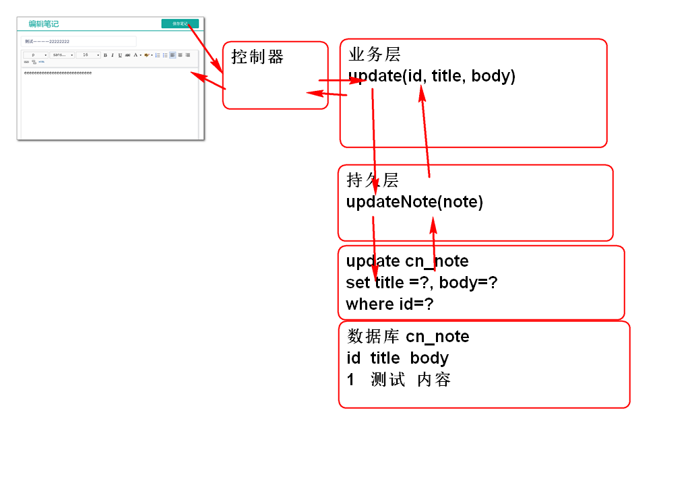
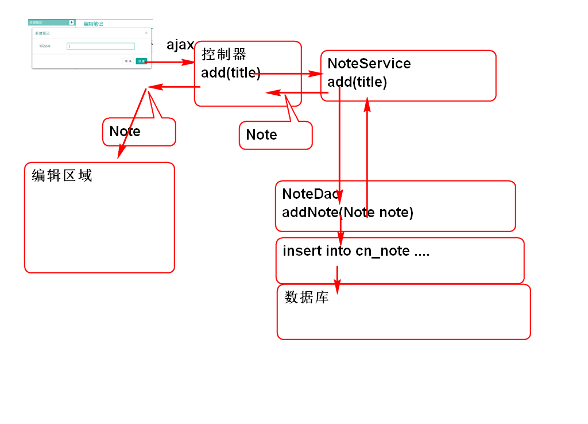

# 云笔记

## 保存笔记功能

原理:

### 1. 开发持久层

1. 添加持久层方法 NoteDao

		int updateNote(Note note);
		
2. 添加SQL NoteMapper.xml

		<update id="updateNote"
    		parameterType="cn.tedu.cloudnote.entity.Note">
    		update
    			cn_note 
    		set
    			<if test="notebookId!=null">
    				cn_notebook_id=#{notebookId},
    			</if>
    			<if test="userId!=null">
    				cn_user_id=#{userId},
    			</if>
    			<if test="statusId!=null">
    				cn_note_status_id=#{statusId},
    			</if>
    			<if test="typeId!=null">
    				cn_note_type_id=#{typeId},
    			</if>
    			<if test="title!=null">
    				cn_note_title=#{title},
    			</if>
    			<if test="body!=null">
    				cn_note_body=#{body},
    			</if>
    			cn_note_last_modify_time=#{lastModifyTime}
    		where 
    			cn_note_id=#{id} 
    	</update>

3. 测试 TestNoteDao

		@Test
		public void testUpdateNote(){
			String noteId = "019cd9e1-b629-4d8d-afd7-2aa9e2d6afe0";
			Note note = dao.findNoteById(noteId);
			System.out.println(note);
			note.setTitle("Test");
			note.setBody("Test123");
			dao.updateNote(note);
			note = dao.findNoteById(noteId);
			System.out.println(note); 
		}

### 2. 实现业务层

1. 添加业务层方法 NoteService

		boolean update(String noteId, String title, String body)
			throws NoteNotFoundException;

2. 实现业务层方法NoteServiceImpl

		public boolean update(String noteId, String title, String body) throws NoteNotFoundException {
			if(noteId==null || noteId.trim().isEmpty()){
				throw new NoteNotFoundException("ID不能空");
			}
			Note note = noteDao.findNoteById(noteId);
			if(note==null){
				throw new NoteNotFoundException("没有对应的笔记");
			}
			Note data = new Note();
			if(title!=null && !title.equals(note.getTitle())){
				data.setTitle(title);
			}
			if(body!=null && !body.equals(note.getBody())){
				data.setBody(body);;
			}
			data.setId(noteId);
			data.setLastModifyTime(System.currentTimeMillis());
			int n = noteDao.updateNote(data);
			return n==1;
		}

3. 测试 TestNoteService

		@Test
		public void testUpdate(){
			String id = "019cd9e1-b629-4d8d-afd7-2aa9e2d6afe0";
			String title = "Java基础";
			String body = "今天天气不错";
			boolean b = service.update(id, title, body);
			Note note = service.getNote(id);
			System.out.println(b);
			System.out.println(note);
		}

### 3. 开发控制器方法

1. 添加控制器方法
	
		@RequestMapping("/update.do")
		@ResponseBody
		public JsonResult update(String noteId,
				String title, String body){
			boolean success = noteService.update(noteId,title, body);
			return new JsonResult(success);
		}	

2. 测试

		http://localhost:8080/cloudnote/note/update.do?noteId=019cd9e1-b629-4d8d-afd7-2aa9e2d6afe0&title=Java

### 4. 界面JS编码

1. 重构showNote方法绑定note数据

		function showNote(note){
			//绑定笔记信息, 用于保存操作
			$('#input_note_title').data('note', note);
			
			$('#input_note_title').val(note.title);
			um.setContent(note.body);
		}

2. 绑定保存按钮的点击事件

		//绑定点击保存笔记事件
		$('#save_note').on('click', updateNote);

3. 添加保存事件方法

		function updateNote(){
			var url = 'note/update.do';
			var note = $('#input_note_title').data('note');
			//data:发送到服务器的参数			
			var data = {noteId:note.id};
			var modified = false;
			var title = $('#input_note_title').val();
			//如果title更改了就向服务器发送title数据
			if(title && title!=note.title){
				data.title = title;
				modified = true;
			}
			var body = um.getContent();
			//如果body更改了就向服务器发送body数据
			if(body && body != note.body ){
				data.body = body;
				modified = true;
			}
			//如果有更改就发起AJAX请求
			if(modified){
				//设置"显示效果"
				$('#save_note').attr('disabled','disabled')
					.html('保存中...');
				
				$.post(url, data, function(result){
					setTimeout(function(){
						//移除显示效果
						$('#save_note').removeAttr('disabled')
							.html('保存笔记');
					},1000);
					if(result.state == 0){
						//console.log("Success!");
						//内存中的 note 改成新的数据
						note.title = title;
						note.body = body;
						//更新笔记列表项目
						var l = $('#pc_part_2 .checked').parent();
						$('#pc_part_2 .checked').remove()
						var li = noteTemplate.replace(
								'[title]', title);
						var a = $(li).find('a');
						a.addClass('checked');
						l.prepend(a);
					}else{
						alert(result.mesage);
					}
				});
			}
		}

4. 部署测试

# JS 的对象

## 创建空白对象

	var obj = new Object();
	var obj1 = {};

## JS 对象可以动态的添加属性

	obj.age = 5;
	obj.name = "范萌萌";

1. obj.name 用于访问属性
2. 如果属性不存在, 则返回 undefined
3. 对属性赋初始值时候,可以添加新属性
4. delete 用于删除属性

		delete obj.age;

5. 可以使用[属性名] 访问属性

		obj['phone']=110;
		var p = obj['phone'];

   > 特殊情况下: 属性名不能直接调用时候必须使用[]

## JS对象的方法

JS对象的方法: 是一个属性! 是引用了函数对象的属性!

	javascript
	obj.hello = function(){
		console.log("Hello World!");
	};
 

> 访问方法时候: obj.hello 访问方法的引用, obj.hello()执行方法

> 在方法中访问当前对象的属性时候, this.不能省略! 

	javascript
	obj.who = function(){
		console.log("I am " + this.name);
	};

> 方法是属性, 可以重新赋值(相当于方法的重写)

##　使用JSON语法创建对象

	javascript
	var obj = {
		age:1, 
		name:"Tom",
		hello:function(){
			console.log("Hello");
		}
	};
	var obj1 = {};
	obj1.age = 1;
	obj1.name = "Jerry";
	obj1.hello = function(){
		console.log("Hello");
	};
 
## 添加笔记功能

原理：

### 1. 持久层

1. 添加持久层方法NoteDao

		int addNote(Note note);

2. ​添加SQL， NoteMapper.xml

		<insert id="addNote"
			parameterType="cn.tedu.note.entity.Note">
			insert into cn_note
				(cn_note_id,
				cn_notebook_id, 
				cn_user_id,
				cn_note_status_id,
				cn_note_type_id,
				cn_note_title,
				cn_note_body,
				cn_note_create_time,
				cn_note_last_modify_time)
			values
				(#{id},#{notebookId},#{userId},
				#{statusId},#{typeId},#{title},
				#{body},#{createTime},
				#{lastModifyTime})
		</insert>

3. 测试 TestNoteDao

### 2. 业务层

1. 业务层方法 NoteService
	
		public Note addNote(String userId, 
				String notebookId, String title)
				throws UserNotFoundException,
				NotebookNotFoundException;

2. 实现业务方法 NoteServiceImpl

		public Note addNote(String userId, 
				String notebookId, String title)
				throws UserNotFoundException, 
				NotebookNotFoundException {
			if(userId==null||userId.trim().isEmpty()){
				throw new UserNotFoundException("ID空");
			}
			User user=userDao.findUserById(userId);
			if(user==null){
				throw new UserNotFoundException("木有人");
			}
			if(notebookId==null||notebookId.trim().isEmpty()){
				throw new NotebookNotFoundException("ID空");
			}
			Notebook notebook=notebookDao.findNotebookById(notebookId);
			if(notebook==null){
				throw new NotebookNotFoundException("没有笔记本");
			}
			if(title==null || title.trim().isEmpty()){
				title="葵花宝典";
			}
			String id = UUID.randomUUID().toString();
			String statusId = "0";
			String typeId = "0";
			String body = "";
			long time=System.currentTimeMillis();
			Note note = new Note(id, notebookId,
				userId, statusId, typeId, title, 
				body, time, time);
			int n = noteDao.addNote(note);
			if(n!=1){
				throw new NoteNotFoundException("保存失败");
			}
			return note;
		}

3. 测试 TestNoteService

		... ...

### 3.控制器

1. 控制器方法NoteController

		@RequestMapping("/add.do")
		@ResponseBody
		public JsonResult add(String userId, 
				String notebookId, String title){
			Note note=noteService.addNote(
				userId, notebookId, title);
			return new JsonResult(note);
		}

2. 浏览器测试

		... ...
		
### 4.JS脚本

1. 绑定事件

		//绑定添加笔记按钮
		$('#add_note').on('click', showAddNoteDialog); 
		
		//绑定关闭按键事件
		$('#can').on('click', '.cancel, .close', closeDialog);
		
		//绑定添加笔记对话框中的 保存按钮事件
		$('#can').on('click', '.save-note', saveNote);

2.  关闭窗口事件方法

		function closeDialog(){
			$('#can').empty();
			$('.opacity_bg').hide();
		}
		
3. 重构loadNotes方法，在点击笔记本时候绑定笔记本ID

		//绑定笔记本ID， 用于添加笔记功能
		$('#input_note_title').data('notebookId', id);
	

4. 打开添加笔记对话框方法

		function showAddNoteDialog(){
			var notebookId=$('#input_note_title').data('notebookId');
			if(notebookId){
				$('.opacity_bg').show();
				$('#can').load('alert/alert_note.html');
			}else{
				alset("请选择笔记本！");
			}
		}	
	
5. 保存笔记按钮事件方法

		//笔记对话框中的 保存按钮事件
		function saveNote(){
			var url = 'note/add.do';
			var notebookId=$('#input_note_title').data('notebookId');
			var title = $('#can #input_note').val();
		 
			var data = {userId:getCookie('userId'),
				notebookId:notebookId,
				title:title};
			//console.log(data);
			
			$.post(url, data, function(result){
				if(result.state==SUCCESS){
					var note=result.data;
					//console.log(note);
					showNote(note);
					closeDialog();   
					//123 
				}else{
					alert(result.message);
				}
			});
		}
