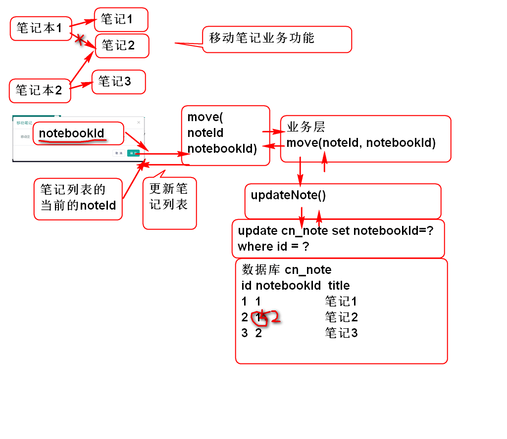

# 云笔记

## 如何检查Ajax通讯过程

利用Chrome浏览器的调试功能可以检查Ajax通讯过程, 可以利用这个工具检查AJAX通讯时候的错误.

## 添加笔记功能

原理：

### 1. 持久层

1. 添加持久层方法NoteDao

		int addNote(Note note);

2. ​添加SQL， NoteMapper.xml

		<insert id="addNote"
			parameterType="cn.tedu.cloudnote.entity.Note">
			insert into cn_note
				(cn_note_id,
				cn_notebook_id, 
				cn_user_id,
				cn_note_status_id,
				cn_note_type_id,
				cn_note_title,
				cn_note_body,
				cn_note_create_time,
				cn_note_last_modify_time)
			values
				(#{id},#{notebookId},#{userId},
				#{statusId},#{typeId},#{title},
				#{body},#{createTime},
				#{lastModifyTime})
		</insert>

3. 测试 TestNoteDao

### 2. 业务层

1. 业务层方法 NoteService
	
		public Note addNote(String userId, 
				String notebookId, String title)
				throws UserNotFoundException,
				NotebookNotFoundException;

2. 实现业务方法 NoteServiceImpl

		public Note addNote(String userId, 
				String notebookId, String title)
				throws UserNotFoundException, 
				NotebookNotFoundException {
			if(userId==null||userId.trim().isEmpty()){
				throw new UserNotFoundException("ID空");
			}
			User user=userDao.findUserById(userId);
			if(user==null){
				throw new UserNotFoundException("木有人");
			}
			if(notebookId==null||notebookId.trim().isEmpty()){
				throw new NotebookNotFoundException("ID空");
			}
			Notebook notebook=notebookDao.findNotebookById(notebookId);
			if(notebook==null){
				throw new NotebookNotFoundException("没有笔记本");
			}
			if(title==null || title.trim().isEmpty()){
				title="葵花宝典";
			}
			String id = UUID.randomUUID().toString();
			String statusId = "0";
			String typeId = "0";
			String body = "";
			long time=System.currentTimeMillis();
			Note note = new Note(id, notebookId,
				userId, statusId, typeId, title, 
				body, time, time);
			int n = noteDao.addNote(note);
			if(n!=1){
				throw new NoteNotFoundException("保存失败");
			}
			return note;
		}

3. 测试 TestNoteService

		... ...

### 3.控制器

1. 控制器方法NoteController

		@RequestMapping("/add.do")
		@ResponseBody
		public JsonResult add(String userId, 
				String notebookId, String title){
			Note note=noteService.addNote(
				userId, notebookId, title);
			return new JsonResult(note);
		}

2. 浏览器测试

		... ...
		
### 4.JS脚本

0. 重构 alert/alert_note.html, 为按钮添加新的class, 用于绑定响应的事件:

		<button type="button" class="btn btn-default cancle cancel" data-dismiss="modal">取 消</button>
		<button type="button" class="btn btn-primary sure save-note">创 建</button>
	
	> 提示: 取消按钮添加了 class cancle,创 建按钮添加了 save-note 
	> 注意: alert_note.html 文件的编码必须是utf-8的!

1. 绑定事件

		//绑定添加笔记按钮
		$('#add_note').on('click', showAddNoteDialog); 
		
		//绑定关闭按键事件
		$('#can').on('click', '.cancel, .close', closeDialog);
		
		//绑定添加笔记对话框中的 保存按钮事件
		$('#can').on('click', '.save-note', saveNote);

2.  关闭窗口事件方法

		function closeDialog(){
			$('#can').empty();
			$('.opacity_bg').hide();
		}
		
3. 重构loadNotes方法，在点击笔记本时候绑定笔记本ID

		//绑定笔记本ID， 用于添加笔记功能
		$('#input_note_title').data('notebookId', id);
	

4. 打开添加笔记对话框方法

		function showAddNoteDialog(){
			var notebookId=$('#input_note_title').data('notebookId');
			if(notebookId){
				$('.opacity_bg').show();
				$('#can').load('alert/alert_note.html');
			}else{
				alert("请选择笔记本！");
			}
		}	
	
5. 保存笔记按钮事件方法

		//笔记对话框中的 保存按钮事件
		function saveNote(){
			var url = 'note/add.do';
			var notebookId=$('#input_note_title')
				.data('notebookId');
			var title = $('#can #input_note').val();
		 
			var data = {userId:getCookie('userId'),
				notebookId:notebookId,
				title:title};
			//console.log(data);
			
			$.post(url, data, function(result){
				if(result.state==SUCCESS){
					var note=result.data;
					//console.log(note);
					showNote(note);
					//找到显示笔记列表的ul对象
					var ul = $('#pc_part_2 .contacts-list');
					var li = noteTemplate.replace(
							'[title]', note.title);
					li = $(li);
					li.find('a').addClass('checked');
					ul.find('a').removeClass('checked');
					ul.prepend(li);
					
					closeDialog();   
					//123 
				}else{
					alert(result.message);
				}
			});
		}

## 添加新笔记本功能

请学员参考 添加笔记功能自行实现

## 显示笔记子菜单

在笔记列表项目上隐藏了一个子菜单, 用于处理笔记相关功能

### 1. 监听菜单按钮弹出子菜单

1. 更新笔记列表模板noteTemplate, 增加class用于识别按钮

		var noteTemplate = 
			'<li class="online">'+
			'	<a><i class="fa fa-file-text-o" title="online" rel="tooltip-bottom"></i> [title]<button type="button" class="btn btn-default btn-xs btn_position btn_slide_down note_menu_btn"><i class="fa fa-chevron-down"></i></button></a>'+
			'	
'+
			'		<dl>'+
			'			<dt><button type="button" class="btn btn-default btn-xs btn_move" title="移动至..."><i class="fa fa-random"></i></button></dt>'+
			'			<dt><button type="button" class="btn btn-default btn-xs btn_share" title="分享"><i class="fa fa-sitemap"></i></button></dt>'+
			'			<dt><button type="button" class="btn btn-default btn-xs btn_delete" title="删除"><i class="fa fa-times"></i></button></dt>'+
			'  		</dl>'+
			'	
'+
			'</li>'; 
	
	> 注意: 增加class note_menu_btn

2. 监听冒泡事件, 在 note_menu_btn 按钮按下时候弹出菜单:

		//监听笔记子菜单按钮点击事件
		$('#pc_part_2').on('click', '.note_menu_btn', showNoteMenu);
		
3. 添加事件处理方法 用于弹出子菜单:

		function showNoteMenu(){
			//如果不是选定的 笔记项目就不显示菜单
			//找到 子菜单, 调用show()方法
			//this 就是点击的按钮对象, 利用按钮的上下文关系
			//找到子菜单, 并且调用show()方法
			var menu=$(this).parent('.checked').next();
			menu.toggle();
			return false;//阻止事件继续传播
		}

4. 添加事件监听在点击文档其他位置时候关闭子菜单

		//点击文档的任何位置都收起笔记子菜单
		$(document).click(closeNoteMenu);

	> 注意: showNoteMenu必须返回false阻止事件的继续冒泡传播, 如果不阻止就会触发关闭事件方法!

5. 添加关闭子菜单的事件处理方法:

		function closeNoteMenu(){
			$('.note_menu').hide();
		}

> 菜单的Dom层级关系如下(参考):

	<body> //document.click(关闭菜单)
		
 //on('click', '.note_menu_btn', 
	                 显示菜单return false)
			<li>
				<a>
					<button class="note_menu_btn"></button> //click
				</a>
				

				

			</li>
		

	</body>

## 移动笔记功能:

原理:

> 移动笔记功能就是更新笔记的笔记本ID即可

### 1. 持久层

	> 重用 updateNote方法

### 2. 业务层

1. NoteService
	
		public boolean moveNote(String noteId, 
			String notebookId)
			throws NoteNotFoundException,
			NotebookNotFoundException;

2. NoteServiceImpl

		public boolean moveNote(String noteId, String notebookId) throws NoteNotFoundException, NotebookNotFoundException {
			if(notebookId==null||notebookId.trim().isEmpty()){
				throw new NotebookNotFoundException("ID空");
			}
			Notebook notebook=notebookDao.findNotebookById(notebookId);
			if(notebook==null){
				throw new NotebookNotFoundException("没有笔记本");
			}
			if(noteId==null || noteId.trim().isEmpty()){
				throw new NoteNotFoundException("ID不能空");
			}
			Note note = noteDao.findNoteById(noteId);
			if(note==null){
				throw new NoteNotFoundException("没有对应的笔记");
			}
			Note data = new Note();
			data.setId(noteId);
			data.setNotebookId(notebookId);
			data.setLastModifyTime(System.currentTimeMillis());
			System.out.println(data); 
			int n = noteDao.updateNote(data);
			return n==1;
		}

3. 测试
	
		略...

### 3. 控制器

1. NoteController

		@RequestMapping("/move.do")
		@ResponseBody
		public JsonResult move(String noteId, 
				String notebookId){
			boolean success=noteService.moveNote(noteId, notebookId);
			return new JsonResult(success);
		}

2. 测试

		略...

### 4. 界面

1. 监听笔记子菜单移动按钮事件:

		//打开移动笔记对话框
		$('#pc_part_2').on('click', '.btn_move', 
				showMoveDialog); 

2. 添加打开笔记对话框事件方法:

		function showMoveDialog(){
			//显示移动笔记的对话框, 在页面加载成功以后, 将
			//列出笔记列表信息
			$('#can').load('alert/alert_move.html', function(){
				//获取全部笔记本列表 li
				//将li中的笔记信息填充到select列表中
				$('#moveSelect').empty();
				$('#pc_part_1 li').each(function(){
					var li = $(this);
					//创建option对象
					var opt = $('<option></option>')
						.val(li.data('notebookId'))
						.html(li.text().trim());
					//添加到 select 列表中
					$('#moveSelect').append(opt);	
				});
			});
		}

3. 重构 alert/alert_move.html 添加 class

		<button type="button" class="btn btn-default cancle cancel" data-dismiss="modal">取 消</button>
		<button type="button" class="btn btn-primary sure move-note">确 定</button>

4. 监听移动对话框中的 确定事件
	
		//绑定移动笔记对话框中的 移动笔记按钮事件
		$('#can').on('click', '.move-note', 
			moveNote);

5. 添加移动笔记事件处理方法

		function moveNote(){
			var url = "note/move.do";
			//得到选定的笔记, 获取当前选定笔记的ID
			var li = $('#pc_part_2 .checked').parent();
			var data = {noteId: li.data('noteId'),
					notebookId: $('#moveSelect').val()}
			$.post(url, data, function(result){
				if(result.state==SUCCESS){
					//更新显示效果
					li.remove();
					closeDialog();
				}else{
					alert(result.message);
				}
			})
		}

## 删除笔记功能:

原理:

## 分享笔记功能:

原理:

