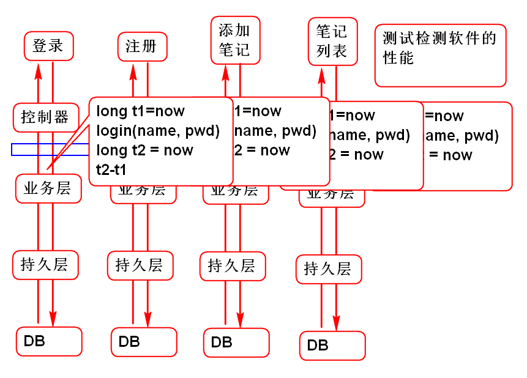
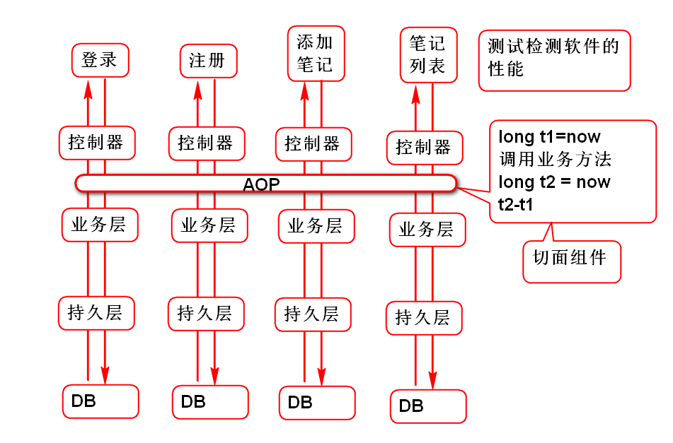
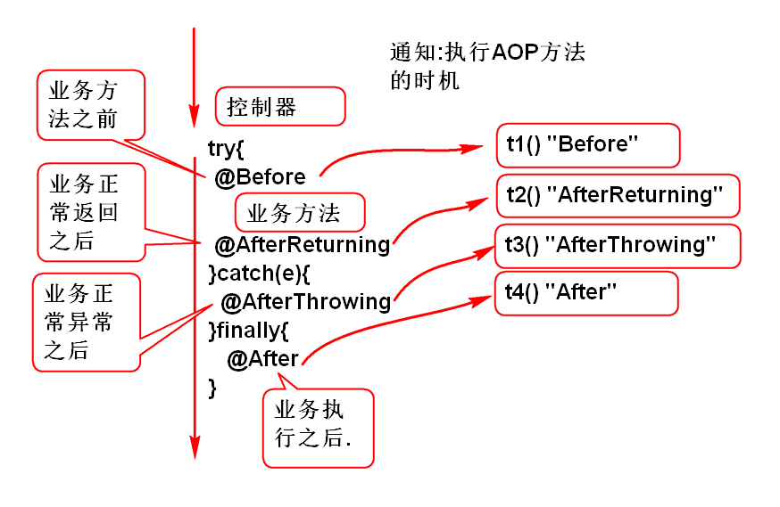
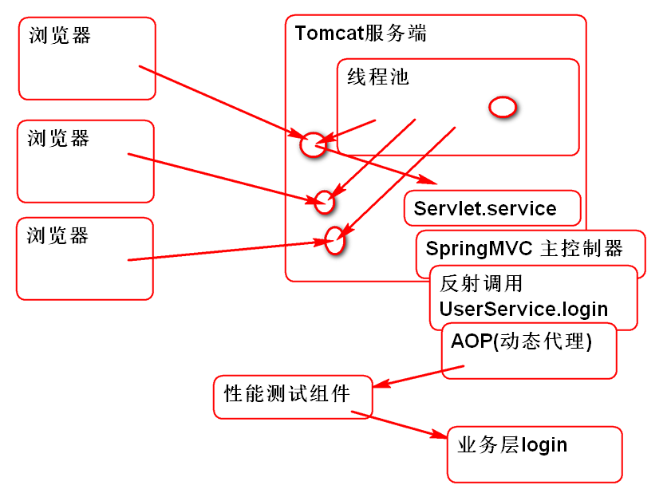
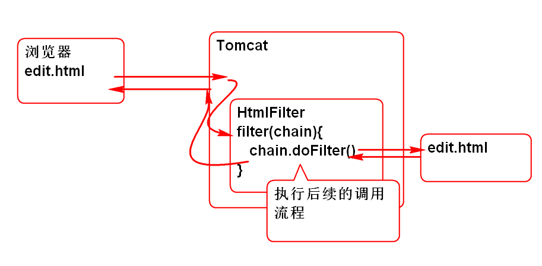

# 云笔记

## AOP 面向切面编程

面向切面(儿)编程: 面向业务的横向编程, 可以在不改变原有业务功能情况下为软件扩展横向功能.

>　切面(儿)　事物的横截面

如果没有AOP, 在实现软件业务层性能测试是这样的:

> 会出现大量的冗余的重复编码

采用AOP就可以剥离 性能测试逻辑, 在不改变原有业务的情况下动态嵌入测试代码:

### Spring AOP 

Spring AOP 是利用 AspectJ API 实现的所以使用 SpringAOP 之前必须导入 AspectJ API 包:
	
	<dependency>
		<groupId>aspectj</groupId>
		<artifactId>aspectjweaver</artifactId>
		<version>1.5.0</version>
	</dependency>

编写第一个AOP程序:

1. 添加Spring AOP配置信息, 开启Spring AOP功能: 添加spring-aop.xml文件:

		<?xml version="1.0" encoding="UTF-8"?>
		<beans xmlns="http://www.springframework.org/schema/beans" 
			xmlns:xsi="http://www.w3.org/2001/XMLSchema-instance"
			xmlns:context="http://www.springframework.org/schema/context" 
			xmlns:jdbc="http://www.springframework.org/schema/jdbc"  
			xmlns:jee="http://www.springframework.org/schema/jee" 
			xmlns:tx="http://www.springframework.org/schema/tx"
			xmlns:aop="http://www.springframework.org/schema/aop" 
			xmlns:mvc="http://www.springframework.org/schema/mvc"
			xmlns:util="http://www.springframework.org/schema/util"
			xmlns:jpa="http://www.springframework.org/schema/data/jpa"
			xsi:schemaLocation="
				http://www.springframework.org/schema/beans http://www.springframework.org/schema/beans/spring-beans-3.2.xsd
				http://www.springframework.org/schema/context http://www.springframework.org/schema/context/spring-context-3.2.xsd
				http://www.springframework.org/schema/jdbc http://www.springframework.org/schema/jdbc/spring-jdbc-3.2.xsd
				http://www.springframework.org/schema/jee http://www.springframework.org/schema/jee/spring-jee-3.2.xsd
				http://www.springframework.org/schema/tx http://www.springframework.org/schema/tx/spring-tx-3.2.xsd
				http://www.springframework.org/schema/data/jpa http://www.springframework.org/schema/data/jpa/spring-jpa-1.3.xsd
				http://www.springframework.org/schema/aop http://www.springframework.org/schema/aop/spring-aop-3.2.xsd
				http://www.springframework.org/schema/mvc http://www.springframework.org/schema/mvc/spring-mvc-3.2.xsd
				http://www.springframework.org/schema/util http://www.springframework.org/schema/util/spring-util-3.2.xsd">
			
			<!-- 支持　@Aspect 注解　 -->
			<aop:aspectj-autoproxy/>
			
		</beans>

2. 编写切面组件:

		@Aspect //<aop:aspectj-autoproxy/>
		@Component //<context:component-scan base-package="cn.tedu" />
		public class DemoAspect {
			
			/**
			 * 在 userService 组件的全部方法之前执行切面方法test
			 */
			@Before("bean(userService)")
			public void test(){
				System.out.println("Hello World");
			}
		}
		
	> 注意:@Aspect 必须与 `<aop:aspectj-autoproxy/>` 配合
	>  @Component 必须与 `<context:component-scan base-package="cn.tedu" />` 配合

3. 启动应用测试: 登录功能是否被动态扩展了功能,输出了 Hello World

### 通知

用于定义AOP组件的执行位置:

1. @Before
2. @AfterReturning
3. @AfterThrowing
4. @After
5. @Around

通知执行原理:

通知测试案例:

	@Aspect
	@Component
	public class AdviceDemoAspect {
		
		@Before("bean(userService)")
		public void t1(){
			System.out.println("Before");
		}
		@AfterReturning("bean(userService)")
		public void t2(){
			System.out.println("AfterReturning");
		}
		@AfterThrowing("bean(userService)")
		public void t3(){
			System.out.println("AfterThrowing");
		}
		@After("bean(userService)")
		public void t4(){
			System.out.println("After");
		}
	}

> 测试观察 每个通知的执行位置

### 环绕通知 @Around

环绕通知可以在业务方法的前后扩展功能

是一个万能通知, 可以替代其他几个通知.

其工作原理如下:

环绕通知案例:

	@Aspect
	@Component
	public class AroundAspect {
	
		//环绕通知
		//使用环绕通知的方法必须包含如下:
		//1. 必须包含方法参数 ProceedingJoinPoint
		//2. 必须有返回值 Object
		//3. 必须抛出异常 Throwable
		@Around("bean(userService)")
		public Object testAround(ProceedingJoinPoint jp)
			throws Throwable{
			System.out.println("Hello Around"); 
			//调用了目标业务方法
			Object val = jp.proceed();
			//返回业务方法的返回值
			return val;
		}
	}

> 提示: jp.proceed(); 用于调用目标的业务方法, 如果不调用就意味着跳过目标业务方法的执行, 这就意味着环绕通知可以影响软件功能的执行!

环绕通知可以替代 其他的通知:

	@Around("bean(userService)")
	public Object testAround(ProceedingJoinPoint jp)
		throws Throwable{
		try{
			//@Before
			//在业务方法之前增加了逻辑功能
			System.out.println("Hello Around"); 
			//调用了目标业务方法
			Object val = jp.proceed();
			//返回业务方法的返回值
			//@AfterReturning
			return val;
		}catch(Throwable e){
			throw e;
			//@AfterThrowing
		}finally{
			//@After
		}
	}

### 切入点 表达式

用于声明AOP组件对那些类,那些Bean对象的方法进行拦截.

有3种切入点:

1. Bean组件切入点(对象)
	- 语法 bean(bean组件ID)
	- bean(userService)
	- bean(userService) || bean(noteService)
	- bean(*Service) 
2. 类切入点
	- within(具体类名)
	- within(cn.tedu.cloudnote.service.UserServiceImpl)
	- within(cn.tedu.cloudnote.service.*ServiceImpl)
	- within(cn.tedu.cloudnote.*.*ServiceImpl)
3. 方法切入点
	- execution(方法签名) 
	- execution(* cn.tedu.cloudnote.service.UserService.login(*,*))
	- execution(* cn.tedu.cloudnote.service.*Service.find*(**))
	- execution(* cn.tedu.cloudnote.*.*Service.find*(**))
	- execution(* cn.tedu.cloudnote.*.*Service.*(**))

> 建议: 使用一致命名规则, 便于书写切入点表达式, 达到同样的目的切入点表达式可以有多重写法. 

###　AOP 的底层工作原理

>　面试期间，面试官很喜欢问的问题！

AOP 底层使用了: 动态代理技术

1. JDK 动态代理, 是JDK提供的API, 是反射包中的一部分
	- java.lang.reflect.Proxy 目标对象必须有接口!
	- Spring AOP 在被代理类有接口情况下 自动使用 JDK 动态代理
2. CGLIB 动态代理, 第三方提供
	- 需要导入 CGLIB 包
	- 被代理的可以是类, 无需接口
	- Spring AOP 在被代理的类没有接口情况下, 自动使用CGLIB
	- 一般不建议使用! 

在业务层方法中插入异常代码, 可以用于分析AOP执行原理:

在login方法中插入:

	String s = "";
	s.charAt(0);

利用异常可以分析 AOP 的底层工作情况:
	
	java.lang.StringIndexOutOfBoundsException: String index out of range: 0
		at java.lang.String.charAt(String.java:658)
		at cn.tedu.cloudnote.service.UserServiceImpl.login(UserServiceImpl.java:35)
		at sun.reflect.NativeMethodAccessorImpl.invoke0(Native Method)
		at sun.reflect.NativeMethodAccessorImpl.invoke(NativeMethodAccessorImpl.java:62)
		at sun.reflect.DelegatingMethodAccessorImpl.invoke(DelegatingMethodAccessorImpl.java:43)
		at java.lang.reflect.Method.invoke(Method.java:497)
		at org.springframework.aop.support.AopUtils.invokeJoinpointUsingReflection(AopUtils.java:317)
		at org.springframework.aop.framework.ReflectiveMethodInvocation.invokeJoinpoint(ReflectiveMethodInvocation.java:183)
		at org.springframework.aop.framework.ReflectiveMethodInvocation.proceed(ReflectiveMethodInvocation.java:150)
		at org.springframework.aop.aspectj.MethodInvocationProceedingJoinPoint.proceed(MethodInvocationProceedingJoinPoint.java:80)
		at cn.tedu.cloudnote.aop.TimeTestAspect.test(TimeTestAspect.java:22)
		at sun.reflect.NativeMethodAccessorImpl.invoke0(Native Method)
		at sun.reflect.NativeMethodAccessorImpl.invoke(NativeMethodAccessorImpl.java:62)
		at sun.reflect.DelegatingMethodAccessorImpl.invoke(DelegatingMethodAccessorImpl.java:43)
		at java.lang.reflect.Method.invoke(Method.java:497)
		at org.springframework.aop.aspectj.AbstractAspectJAdvice.invokeAdviceMethodWithGivenArgs(AbstractAspectJAdvice.java:621)
		at org.springframework.aop.aspectj.AbstractAspectJAdvice.invokeAdviceMethod(AbstractAspectJAdvice.java:610)
		at org.springframework.aop.aspectj.AspectJAroundAdvice.invoke(AspectJAroundAdvice.java:65)
		at org.springframework.aop.framework.ReflectiveMethodInvocation.proceed(ReflectiveMethodInvocation.java:172)
		at org.springframework.aop.interceptor.ExposeInvocationInterceptor.invoke(ExposeInvocationInterceptor.java:91)
		at org.springframework.aop.framework.ReflectiveMethodInvocation.proceed(ReflectiveMethodInvocation.java:172)
		at org.springframework.aop.framework.JdkDynamicAopProxy.invoke(JdkDynamicAopProxy.java:204)
		at com.sun.proxy.$Proxy45.login(Unknown Source)
		at cn.tedu.cloudnote.controller.UserController.login(UserController.java:26)
		at sun.reflect.NativeMethodAccessorImpl.invoke0(Native Method)
		at sun.reflect.NativeMethodAccessorImpl.invoke(NativeMethodAccessorImpl.java:62)
		at sun.reflect.DelegatingMethodAccessorImpl.invoke(DelegatingMethodAccessorImpl.java:43)
		at java.lang.reflect.Method.invoke(Method.java:497)
		at org.springframework.web.method.support.InvocableHandlerMethod.invoke(InvocableHandlerMethod.java:215)
		at org.springframework.web.method.support.InvocableHandlerMethod.invokeForRequest(InvocableHandlerMethod.java:132)
		at org.springframework.web.servlet.mvc.method.annotation.ServletInvocableHandlerMethod.invokeAndHandle(ServletInvocableHandlerMethod.java:104)
		at org.springframework.web.servlet.mvc.method.annotation.RequestMappingHandlerAdapter.invokeHandleMethod(RequestMappingHandlerAdapter.java:745)
		at org.springframework.web.servlet.mvc.method.annotation.RequestMappingHandlerAdapter.handleInternal(RequestMappingHandlerAdapter.java:686)
		at org.springframework.web.servlet.mvc.method.AbstractHandlerMethodAdapter.handle(AbstractHandlerMethodAdapter.java:80)
		at org.springframework.web.servlet.DispatcherServlet.doDispatch(DispatcherServlet.java:925)
		at org.springframework.web.servlet.DispatcherServlet.doService(DispatcherServlet.java:856)
		at org.springframework.web.servlet.FrameworkServlet.processRequest(FrameworkServlet.java:953)
		at org.springframework.web.servlet.FrameworkServlet.doPost(FrameworkServlet.java:855)
		at javax.servlet.http.HttpServlet.service(HttpServlet.java:646)
		at org.springframework.web.servlet.FrameworkServlet.service(FrameworkServlet.java:829)
		at javax.servlet.http.HttpServlet.service(HttpServlet.java:727)
		at org.apache.catalina.core.ApplicationFilterChain.internalDoFilter(ApplicationFilterChain.java:303)
		at org.apache.catalina.core.ApplicationFilterChain.doFilter(ApplicationFilterChain.java:208)
		at org.apache.tomcat.websocket.server.WsFilter.doFilter(WsFilter.java:52)
		at org.apache.catalina.core.ApplicationFilterChain.internalDoFilter(ApplicationFilterChain.java:241)
		at org.apache.catalina.core.ApplicationFilterChain.doFilter(ApplicationFilterChain.java:208)
		at org.apache.catalina.core.StandardWrapperValve.invoke(StandardWrapperValve.java:220)
		at org.apache.catalina.core.StandardContextValve.invoke(StandardContextValve.java:122)
		at org.apache.catalina.authenticator.AuthenticatorBase.invoke(AuthenticatorBase.java:501)
		at org.apache.catalina.core.StandardHostValve.invoke(StandardHostValve.java:171)
		at org.apache.catalina.valves.ErrorReportValve.invoke(ErrorReportValve.java:102)
		at org.apache.catalina.valves.AccessLogValve.invoke(AccessLogValve.java:950)
		at org.apache.catalina.core.StandardEngineValve.invoke(StandardEngineValve.java:116)
		at org.apache.catalina.connector.CoyoteAdapter.service(CoyoteAdapter.java:408)
		at org.apache.coyote.http11.AbstractHttp11Processor.process(AbstractHttp11Processor.java:1040)
		at org.apache.coyote.AbstractProtocol$AbstractConnectionHandler.process(AbstractProtocol.java:607)
		at org.apache.tomcat.util.net.JIoEndpoint$SocketProcessor.run(JIoEndpoint.java:314)
		at java.util.concurrent.ThreadPoolExecutor.runWorker(ThreadPoolExecutor.java:1142)
		at java.util.concurrent.ThreadPoolExecutor$Worker.run(ThreadPoolExecutor.java:617)
		at org.apache.tomcat.util.threads.TaskThread$WrappingRunnable.run(TaskThread.java:61)
		at java.lang.Thread.run(Thread.java:745)

### 3种功能拦截编程的区别:

1. Servlet Filter
	- 可以拦截所有的 HTTP 请求: *.html *.js *.png *.do *.jsp *.mp3
	- 在HTTP协议层面进行拦截式编程时候使用!
	- 如: 限制*.mp3的下载, 限制*.png的查看等
2. Spring MVC 拦截器
	- 工作在Spring MVC 的容器中, 可以拦截SpringMVC的工作流程
	- 在Spring MVC中对工作流程进行拦截式编程, 可以使用Spring MVC 拦截器. 处理*.do可以使用 Spring MVC 拦截器.
3. Spring AOP 
	- 工作在 Spring容器中的各个组件之间, 可以拦截Bean组件之间的调用
	- 用于在Spring组件之间的拦截式编程.

Servlet Filter案例, 拦截*.html *.js的请求:

1. 添加过滤器类:

		public class HtmlFilter implements Filter {
			public void init(FilterConfig cfg) 
					throws ServletException {
			}
			public void destroy() {
			}
			public void doFilter(ServletRequest req, 
					ServletResponse res, FilterChain chain)
					throws IOException, ServletException {
				HttpServletRequest request =
						(HttpServletRequest) req;
				//获取请求的文件名:
				String path=request.getRequestURI();
				System.out.println(path); 
				chain.doFilter(req, res);
			}
		}	
2. 配置Filter, web.xml:

		  <filter>
		  	 <filter-name>html</filter-name>
		  	 <filter-class>cn.tedu.cloudnote.web.HtmlFilter</filter-class>
		  </filter>
		  <filter-mapping>
		  	 <filter-name>html</filter-name>
		  	 <url-pattern>*.html</url-pattern>
		  </filter-mapping>  
		  <filter-mapping>
		  	 <filter-name>html</filter-name>
		  	 <url-pattern>*.js</url-pattern>
		  </filter-mapping> 

3. 测试...

------------------
## 作业

1. 为软件增加性能测试功能