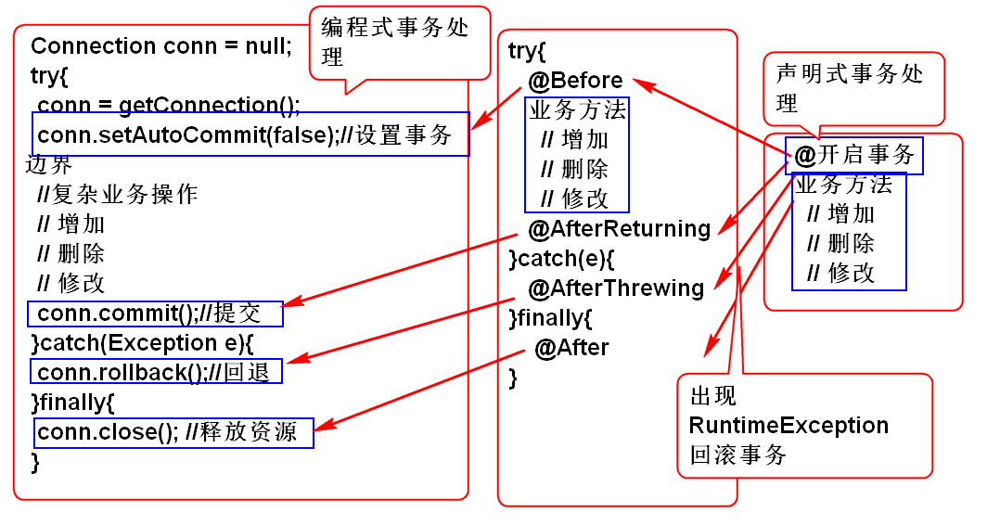
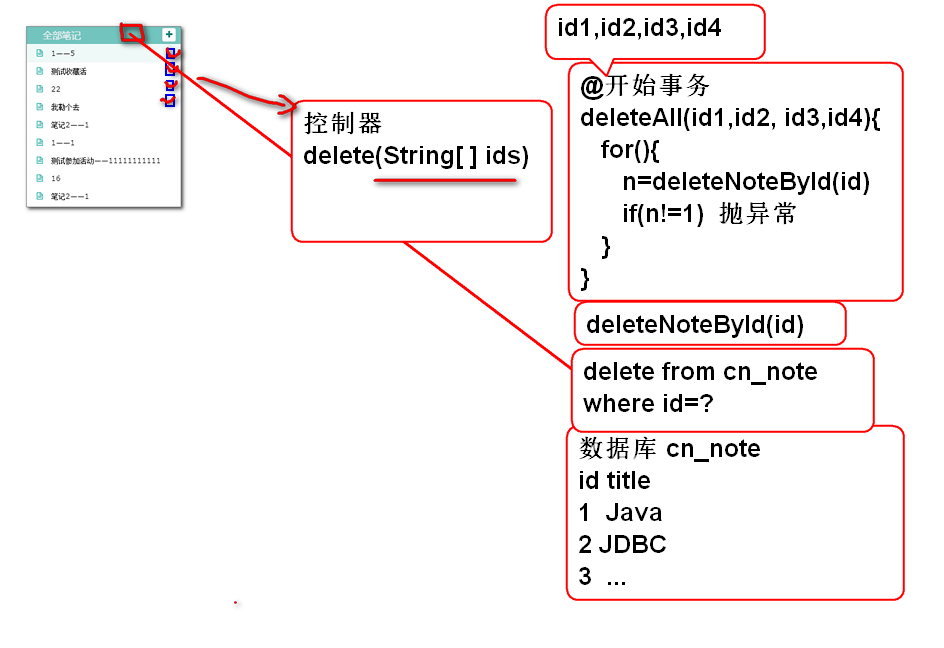
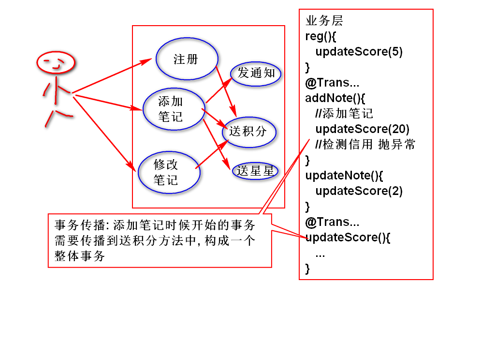
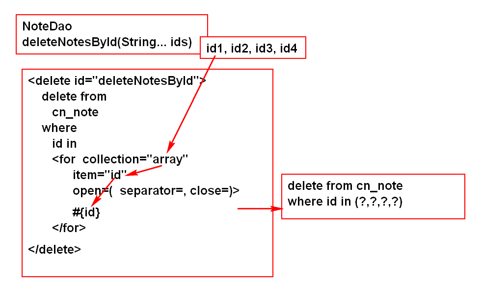
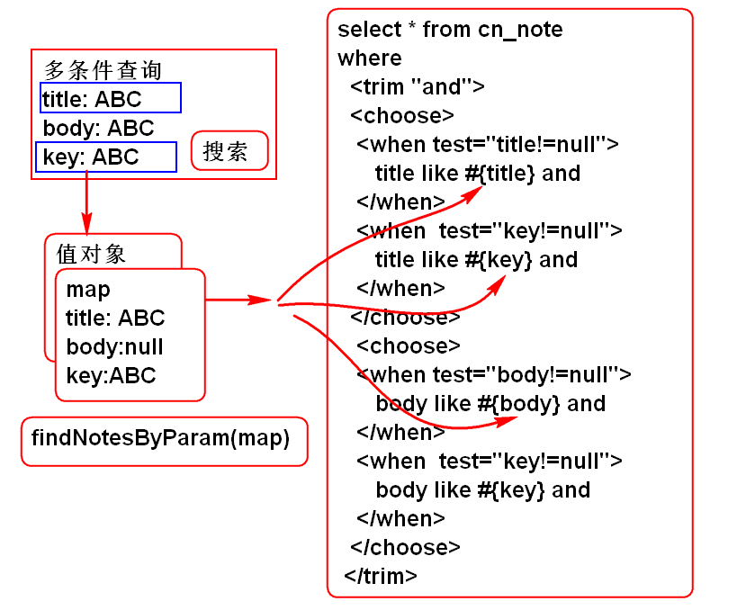

# 云笔记

## Spring 声明式事务处理

回顾: 编程式事务处理

	Connection conn = null;
	try{
		conn = getConnection();
		conn.setAutoCommit(false);//设置事务边界
		//复杂业务操作
		// 增加
		// 删除
		// 修改
		conn.commit();//提交
	}catch(Exception e){
		conn.rollback();//回退
	}finally{
		conn.close(); //释放资源
	}

> 缺点: 繁琐的编程事务处理, 产生大量的冗余重复的代码.

声明式事务处理: 利用AOP机制便捷的管理事务

### 使用Spring 声明式事务处理

1. 配置事务管理器, MyBatis使用数据源事务管理器. spring-mybatis.xml
	
		<!-- spring-mybatis.xml -->
		<!-- 配置事务管理器, 使声明式事务管理生效 -->
		<tx:annotation-driven 
			transaction-manager="txManager"/> 
		<!-- txManager 是一个 Bean 组件 -->
		<!-- MyBatis 使用Spring提供的DataSourceTransactionManager
			DataSourceTransactionManager 必须设置属性dataSource  -->
		<bean id="txManager"  class="org.springframework.jdbc.datasource.DataSourceTransactionManager">
			<property name="dataSource" ref="dbcp"></property>
		</bean>

2. 在需要事务保护的业务方法上使用 事务注解

		@Transactional //必须配置事务管理器才能生效
		public boolean moveNote(String noteId, String notebookId) throws NoteNotFoundException, NotebookNotFoundException {
			if(notebookId==null||notebookId.trim().isEmpty()){
				throw new NotebookNotFoundException("ID空");
			}
			Notebook notebook=notebookDao.findNotebookById(notebookId);
			if(notebook==null){
				throw new NotebookNotFoundException("没有笔记本");
			}
			if(noteId==null || noteId.trim().isEmpty()){
				throw new NoteNotFoundException("ID不能空");
			}
			Note note = noteDao.findNoteById(noteId);
			if(note==null){
				throw new NoteNotFoundException("没有对应的笔记");
			}
			Note data = new Note();
			data.setId(noteId);
			data.setNotebookId(notebookId);
			data.setLastModifyTime(System.currentTimeMillis());
			System.out.println(data); 
			int n = noteDao.updateNote(data);
			
			//String s = "";
			//s.charAt(0);
			
			return n==1;
		}

	> String s = ""; s.charAt(0); 用于在方法中产生运行时异常, 触发事务回滚操作. 如果事务回滚了则.updateNote(data) 更改效果取消了.
 
3. 测试: 当方法中出现运行时异常, 事务会回退.

批量删除的事务测试:

1. 添加持久层方法 NoteDao

		int deleteNoteById(String id);

2. 添加SQL 语句 NoteMapper.xml
	
		<delete id="deleteNoteById"
			parameterType="string">
			delete from
				cn_note
			where 
				cn_note_id=#{id}
		</delete>

3. 添加业务层方法 NoteService

		boolean deleteNotes(String... ids);
		// String[]  ==  String... 变长参数
		// 调用时候:
		// String[] 参数 必须传递数组参数:
		//   deleteNotes(new String[]{"id1","id2","id3"})
		// String... 参数可以直接传递元素:
		//   deleteNotes("id1","id2","id3","id4")
		// 或deleteNotes(new String[]{"id1","id2","id3"})
		//   编译器会将"id1","id2","id3" 替换为数组
		// 注意: String... 只能使用在最后一个参数位置

4. 实现业务方法 NoteServiceImpl
	
		@Transactional
		public boolean deleteNotes(String... ids) {
			for(String id : ids){
				int n = noteDao.deleteNoteById(id);
				if(n!=1){
					throw new NoteNotFoundException( "ID错误!");
				}
			}
			return true;
		}

5.测试 TestNoteService

		@Test
		public void testDeleteNotes(){
			String id1 = "3febebb3-a1b7-45ac-83ba-50cdb41e5fc1";
			String id2 = "9187ffd3-4c1e-4768-9f2f-c600e835b823";
			String id3 = "ebd65da6-3f90-45f9-b045-782928a5e2c0";
			String id4 = "fed920a0-573c-46c8-ae4e-368397846efd";
			boolean b = service.deleteNotes(
					id1, id2, id3, id4);
			System.out.println(b);
		}	

	> 说明: 当提交的id有错误时候, 会回滚事务, 取消删除操作, 只有ID全部是正确的情况下才会提交事务.
	
### 事务的只读属性

	@Transactional(readOnly=true)

用于声明只读(readOnly)属性: 如果业务方法没有对数据进行更改, 可以使用只读属性, 可以提高方法执行性能. 建议如果只是读取数据, 可以设置这个属性为true

###　事务的隔离级别

1. @Transactional(isolation=Isolation.SERIALIZABLE) 
	- 序列化:　完全隔离，最安全，同一个数据一个用户操作期间，其他用户必须等待，性能最差！
2. @Transactional(isolation=Isolation.REPEATABLE_READ)
	- 可以重复读: 可以返回读取到一致数据, 性能比序列化好
3. @Transactional(isolation=Isolation.READ_COMMITTED)
	- @Transactional(isolation=Isolation.DEFAULT)
	- 读取提交以后的数据: 最常用的隔离级别, 是默认值!
4. @Transactional(isolation=Isolation.READ_UNCOMMITTED)
	- 读取未提交数据: 不隔离, 不推荐使用!

> 重点: 一般都是使用默认的隔离级别READ_COMMITTED! 性能和隔离性折中方案!!!
	
### 事务的传播

为什么要事务的传播: 业务方法调用业务方法时候往往需要将这些方法整合为一个事务.

事务传播属性:

1. @Transactional(propagation=Propagation.REQUIRED)
	- 需要事务: 如果当前方法调用时候已经开启事务, 则自动参与当前事务, 如果当前没有事务, 则自动开启新事务.
	- 默认值: 最常用规则.
2. @Transactional(propagation=Propagation.NEVER)
	- 绝不: 绝不参与事务, 如果在事务方法中调用就抛出异常!
3. @Transactional(propagation=Propagation.MANDATORY)
	- 必须的: 必须在事务过程调用, 没有就抛出异常
4. @Transactional(propagation=Propagation.NESTED)
	- 嵌套：必须在事务方法中调用, 不能单独调用
5. @Transactional(propagation=Propagation.SUPPORTS)
	- 支持事务:　使用被事务方法调用, 但是单独调用时候不开启事务
6. @Transactional(propagation=Propagation.REQUIRES_NEW)
	- 必须是新事务:　永远开启新事务

> REQUIRED: 是最常用的默认值! 

> 注意: 在面试之前一定要了解事务的传播和隔离级别默认值!

事务传播案例:

1. 添加子业务方法 NoteService 

		@Transactional
		public void addScore(){
			String s = null;
			s.length();
		}

2. 在业务方法中调用子业务方法

		@Transactional
		public Note addNote(String userId, 
				String notebookId, String title)
				throws UserNotFoundException, 
				NotebookNotFoundException {
		
			if(userId==null||userId.trim().isEmpty()){
				throw new UserNotFoundException("ID空");
			}
			User user=userDao.findUserById(userId);
			if(user==null){
				throw new UserNotFoundException("木有人");
			}
			if(notebookId==null||notebookId.trim().isEmpty()){
				throw new NotebookNotFoundException("ID空");
			}
			Notebook notebook=notebookDao.findNotebookById(notebookId);
			if(notebook==null){
				throw new NotebookNotFoundException("没有笔记本");
			}
			if(title==null || title.trim().isEmpty()){
				title="葵花宝典";
			}
			String id = UUID.randomUUID().toString();
			String statusId = "0";
			String typeId = "0";
			String body = "";
			long time=System.currentTimeMillis();
			Note note = new Note(id, notebookId,
				userId, statusId, typeId, title, 
				body, time, time);
			int n = noteDao.addNote(note);
			if(n!=1){
				throw new NoteNotFoundException("保存失败");
			}
			//调用子业务方法
			addScore();
			return note;
		}

3. 测试: 当子业务方法出现异常时候, 子业务方法和主业务方法的事务都进行回滚操作.

## MyBatis 动态SQL拼接

MyBatis 提供了丰富的动态SQL生成功能:

	<if>
	<foreach>
	<choose>
	<where>
	<set>
	<trim>

### for的使用

用于处理数组或者List, 经常用于生成 id in (id1, id2, id3) 等条件

批量删除笔记功能(优化): 批量删除时候讲SQL优化为一个SQL可以提高数据库访问性能.

1. 添加持久层方法: NoteDao

		int deleteNotesById(String... ids);
	
2. 添加SQL, NoteMapper.xml:

		<delete id="deleteNotesById">
			delete from
				cn_note
			where 
				cn_note_id in
			<foreach collection="array"
				item="id"
				open="(" separator="," close=")">
				#{id}
			</foreach>
			<choose>
				<when test=""></when>
			</choose>
		</delete>

3. 测试: TestNoteDao

		@Test
		public void testDeleteNotesById(){
			String id1="c347f832-e2b2-4cb7-af6f-6710241bcdf6";
			String id2="07305c91-d9fa-420d-af09-c3ff209608ff";
			String id3="5565bda4-ddee-4f87-844e-2ba83aa4925f";
			String id4="1ec185d6-554a-481b-b322-b562485bb8e8";
			int n = dao.deleteNotesById(id1, id2, id3, id4);
			System.out.println(n); 
		}
	
	> 注意: 这个测试案例没有事务保护

4. 优化业务层批量删除方法: NoteServiceImpl

		@Transactional
		public boolean deleteNotes(String... ids) {
			int n = noteDao.deleteNotesById(ids);
			if(n == ids.length){
				return true;
			}
			throw new NoteNotFoundException("ID错误!");
		}

	> 这个方法有事务保护

###  choose 的使用

经常用于多参数拼接查询:

案例:

1. 添加持久层方法 NoteDao
	
		/**
		 * 多参数查询 
		 * @param param 可以接受参数 title, body, key 
		 * @return
		 */
		List<Map<String, Object>> findNotesByParam(
				Map<String, Object> param);

	> 利用map封装查询参数

2. 添加SQL NoteMapper.xml

		<select id="findNotesByParam"
			parameterType="map"
			resultType="map">
			select 
				cn_note_id as id,
				cn_note_title as title
			from 
				cn_note
			<where>
				<trim suffixOverrides="or">
					<choose>
						<when test="title!=null">
							cn_note_title like #{title} or
						</when>		
						<when test="key!=null">
							cn_note_title like #{key} or
						</when>
					</choose>
					<choose>
						<when test="body!=null">
							cn_note_body like #{body} 
						</when>
						<when test="key!=null">
							cn_note_body like #{key}
						</when>
					</choose>
				</trim>
			</where>
		</select>

	> where 子句可以替换为 `<where>` 标签, 其结果一样!

3. 测试: TestNoteDao
	
		@Test
		public void testFindNotesByParam(){
			Map<String, Object> param=
					new HashMap<String, Object>();
			param.put("title", "%ABC%");
			param.put("body", "%ABC%");
			param.put("key", "%1%");
			List<Map<String, Object>> list=
				dao.findNotesByParam(param);
			for (Map<String, Object> map : list) {
				System.out.println(map); 
			}
		}

	> 可以进行组合参数查询测试

### @Param 参数注解

MyBatis 可以利用@Param 标注多个参数:

1. 接口方法 NoteDao

		List<Map<String, Object>> findNotesByKey(
				@Param("title") String title,  
				@Param("body") String body, 
				@Param("key") String key);	

2. SQL  NoteMapper.xml

		<select id="findNotesByKey"
			resultType="map">
			select 
				cn_note_id as id,
				cn_note_title as title
			from 
				cn_note
			<where>
				<trim suffixOverrides="or">
					<choose>
						<when test="title!=null">
							cn_note_title like #{title} or
						</when>		
						<when test="key!=null">
							cn_note_title like #{key} or
						</when>
					</choose>
					<choose>
						<when test="body!=null">
							cn_note_body like #{body} 
						</when>
						<when test="key!=null">
							cn_note_body like #{key}
						</when>
					</choose>
				</trim>
			</where>
		</select>

3. 测试 TestNoteDao
	
		@Test
		public void testFindNotesByKey(){
			List<Map<String, Object>> list=
					dao.findNotesByKey(
					"%1%", null, null);
			for (Map<String, Object> map : list) {
				System.out.println(map);
			}
		}

-----------------------------

## 作业

1. 为云笔记项目增加声明式事务
2. 实现复杂参数查询功能

	

