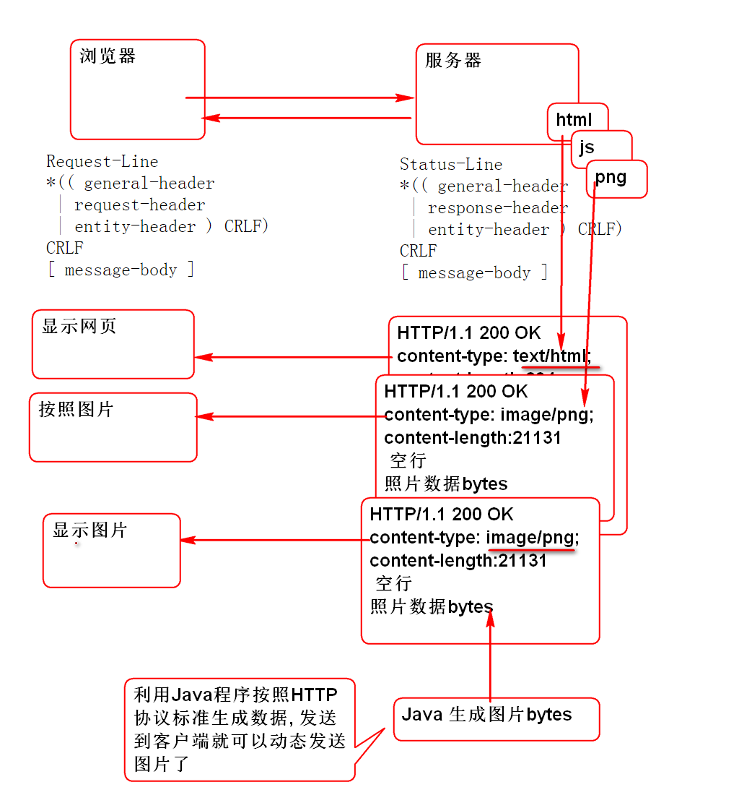

# 云笔记

## 文件的下载

HTTP 支持任何文件类型的下载

请参考: [http://doc.tedu.cn/rfc/rfc2616.txt](http://doc.tedu.cn/rfc/rfc2616.txt)

文件下载原理: Web 服务器将需要发送的文件按照HTTP协议封装为Response包, 发送到客户端, 客户端浏览器根据Response中的协议头决定如何处理文件.

## 文件下载原理

利用Java程序(Servlet, Spring MVC) 将数据按照HTTP标准封装为Response包,发送到浏览器客户端就可以实现文件的下载.

### 利用Servlet生成图片发送浏览器:

1. 利用Servlet 生成图片, 并且按照HTTP协议标准发送的浏览器

		public class ImageServlet extends HttpServlet {
			
			@Override
			protected void doGet(HttpServletRequest req, 
					HttpServletResponse resp) 
					throws ServletException, IOException {
				//获取要发送的图片数据
				byte[] png = createPng();
				resp.setContentType("image/png");
				resp.setContentLength(png.length);
				//将png图片写入body
				resp.getOutputStream().write(png);
				resp.getOutputStream().close();
			}
			
			//动态生成图片数据
			public byte[] createPng() throws IOException{
				//1. 创建图片对象
				BufferedImage img = new BufferedImage(
					200, 100, BufferedImage.TYPE_3BYTE_BGR);
				img.setRGB(100, 50, 0xffffff); 
				//2. 将图片编码为 png
				ByteArrayOutputStream out=
						new ByteArrayOutputStream();
				ImageIO.write(img, "png", out);
				out.close();
				//3. 得到所有的bytes
				byte[] ary = out.toByteArray();
				return ary;
			}
		}
	
	> 提示:　服务器需要先发送ContentType, 和ContentLength, 再将png数据放在消息Body发送到客户端.

2. 部署Servlet

		<servlet>
			 <servlet-name>png</servlet-name>
			 <servlet-class>cn.tedu.cloudnote.web.ImageServlet</servlet-class>
		</servlet>
		<servlet-mapping>
			 <servlet-name>png</servlet-name>
			 <url-pattern>/demopng</url-pattern>
		</servlet-mapping>

3. 浏览器测试:

		http://localhost:8080/cloudnote/demopng

4. 在网页中显示 demo.html
		
		<!DOCTYPE html>
		<!-- demo.html -->
		<html>
		<head>
		<meta charset="UTF-8">
		<title>DEMO</title>
		</head>
		<body>
			<h1>显示图片</h1>
			
		</body>
		</html>
	
5. 浏览器测试:

		http://localhost:8080/cloudnote/demo.html

### 利用Spring MVC 动态生成图片

1. 编写控制器动态生成图片 DemoController

		@Controller
		@RequestMapping("/demo")
		public class DemoController {

			@RequestMapping(
					produces="image/png",
					value="/png.do")
			@ResponseBody
			public byte[] png() 
				throws Exception{
				byte[] png = createPng();
				return png;//填充响应消息的 body
			}
			
			public byte[] createPng() throws IOException{
				//1. 创建图片对象
				BufferedImage img = new BufferedImage(
					200, 100, BufferedImage.TYPE_3BYTE_BGR);
				img.setRGB(100, 50, 0xffffff); 
				//2. 将图片编码为 png
				ByteArrayOutputStream out=
						new ByteArrayOutputStream();
				ImageIO.write(img, "png", out);
				out.close();
				//3. 得到所有的bytes
				byte[] ary = out.toByteArray();
				return ary;
			}
		}
	
	> produces="image/png" 用于向客户端发送协议头:ContentType
	> @ResponseBody 会自动的将返回值 byte[] 封装到协议Body中发送到客户端. 
	> @ResponseBody 不仅能处理Json返回值, 还能处理2进制数据byte[]

2. 客户端利用img标签显示图片: demo.html
	
			

3. 测试

		...

### 利用Spring MVC动态生成Excel文件:

1. 导入Excel处理API POI

		<dependency>
		  <groupId>org.apache.poi</groupId>
		  <artifactId>poi</artifactId>
		  <version>3.13</version>
		</dependency>

2. 利用Spring控制器生成Excel文件: DemoController

		@RequestMapping(
				produces="application/vnd.ms-excel",
				value="/excel.do")
		@ResponseBody
		public byte[] excel(HttpServletResponse res) throws Exception{
			byte[] bytes = createExcel();
			//按照HTTP协议 RFC2616 19.5.1 Content-Disposition 发送文件名
			res.addHeader("Content-Disposition",
					"attachment; filename=\"hello.xls\"");
			//Content-Disposition: attachment; filename="fname.ext"
			return bytes;
		}
		
		private byte[] createExcel() throws IOException{
			//1. 利用POI API创建Excel对象
			//创建Excel 工作簿
			HSSFWorkbook workbook = new HSSFWorkbook();
			//创建工作表
			HSSFSheet sheet = workbook.createSheet();
			//在表中创建行和列
			HSSFRow row = sheet.createRow(0);
			HSSFCell cell = row.createCell(0);
			//在 0,0 格子中写入 Hello World! 
			cell.setCellValue("Hello World!"); 
			//调用业务层
			//2. 将Excel对象编码为byte[]
			ByteArrayOutputStream out = 
					new ByteArrayOutputStream();
			workbook.write(out);
			out.close();
			
			//3. 返回 byte[] 
			byte[] bytes = out.toByteArray();
			return bytes;
		}
	
	> produces="application/vnd.ms-excel" 用于向客户端发送Excel文件的ContentType
	> Content-Disposition 协议头用于发送下载保存文件的名称.

3. 在网页中添加下载链接 demo.html
	
		<h1>下载Excel</h1>
		<a href="demo/excel.do">Excel</a>
		
4. 测试...

## 文件上载

文件上载标准为: [http://doc.tedu.cn/rfc/rfc1867.txt](http://doc.tedu.cn/rfc/rfc1867.txt)

客户端要求: 

1. form设置编码属性 ENCTYPE="multipart/form-data"
2. form必须使用METHOD="POST"
3. 在form中使用 `<INPUT id="file1" NAME="userfile1" TYPE="file">` 选取上载文件.

服务器要求: 

1. 利用上载API解析 multipart 上载请求.

### 利用Spring MVC 完成文件上载解析

Spring MVC 提供了上载请求解析功能, 其底层利用了 Apache 提供的 fileupload 组件. 

为了能够处理文件上载请求, Spring需要做如下配置:

1. 导入fileupload组件:

		<dependency>
		  <groupId>commons-fileupload</groupId>
		  <artifactId>commons-fileupload</artifactId>
		  <version>1.3.2</version>
		</dependency>

2. 配置上载解析器: spring-mvc.xml
	
		<bean id="multipartResolver"
		    class="org.springframework.web.multipart.commons.CommonsMultipartResolver">
		    <property name="maxUploadSize" value="1000000"/>
		</bean>
			
Spring MVC处理文件上载:

1. 客户端 demo.html:

		<h1>上载文件</h1>
		
		<FORM ENCTYPE="multipart/form-data" 
			ACTION="demo/upload.do" 
			METHOD="POST">
			File to process: 
			<INPUT id="file1" NAME="userfile1" TYPE="file">
			<INPUT id="file2" NAME="userfile2" TYPE="file">
			<INPUT TYPE="submit" VALUE="Send File">
		</FORM>

2. 控制器
	
		@RequestMapping("/upload.do")
		@ResponseBody
		public String upload(
				MultipartFile userfile1,
				MultipartFile userfile2) throws Exception{
			//Spring MVC 会自动解析文件上载流, 将上载信息
			// 保存到 MultipartFile 对象中, 注入控制器
			//前提:导入Apache 文件上载包和配置上载解析器
			System.out.println(userfile1);
			System.out.println(userfile2);
			//显示原始文件名
			System.out.println(
					userfile1.getOriginalFilename());
			System.out.println(
					userfile2.getOriginalFilename());
			String name = userfile2.getOriginalFilename();
			//处理文件名编码问题
			name = new String(
				name.getBytes("iso8859-1"), "utf-8");
			System.out.println(name);
			//获取文件的数据
			byte[] data1 = userfile1.getBytes();
			//byte[] data2 = userfile2.getBytes();
			//InputStream in1 = userfile1.getInputStream();
			InputStream in2 = userfile2.getInputStream();
			
			//保存文件   /home/soft01/upload
			File path = new File("D:/upload");
			path.mkdir();
			//文件名解码
			String n1 = userfile1.getOriginalFilename();
			n1 = new String(n1.getBytes("iso8859-1"),"utf-8");
			//将文件保存到 upload 文件夹中
			File file1 = new File(path, n1);
			FileOutputStream out1 = 
					new FileOutputStream(file1);
			//将数据保存到流中
			out1.write(data1);//将data1中全部的数据写到文件
			out1.close();
			
			//保存第二个文件
			String n2 = userfile2.getOriginalFilename();
			n2 = new String(n2.getBytes("iso-8859-1"), "utf-8");
			File file2 = new File(path, n2);
			FileOutputStream out2 = 
					new FileOutputStream(file2);
			//读取第2个文件的全部数据写到out2中
			int b;
			while((b=in2.read())!=-1){
				out2.write(b);
			}
			in2.close();
			out2.close();
			
			//上载文件的其他信息: 
			//获取文件的类型 
			String type1 = userfile1.getContentType();
			String type2 = userfile2.getContentType();
			//获取表单输入input 控件的名字name
			String name1 = userfile1.getName();
			String name2 = userfile2.getName();
			//获取文件的大小
			long size1 = userfile1.getSize();
			long size2 = userfile2.getSize();
			
			return "OK";
		}

	> 注意: 控制器方法参数 userfile1 与上载`<input type="file" name="userfile1">` 的name属性一致

3. 测试

	> 注意: 文件大小限制在 文件上载解析器中配置.

### Ajax上载控制

利用最新版本的 XMLHttpRequest 2 对象可以进行异步文件上载.

检测浏览器是否支持异步上载:

		//检测 AJAX 文件上载需要的对象:
		//1. FormData 对象
		//2. XHR.onload
		if(window.FormData){
			console.log("FormData OK");
		}
		
		var xhr = new XMLHttpRequest();
		if(xhr.upload){
			console.log("upload OK");
		}

利用Ajax实现文件上载 demo.html:

	File to process: 
	<INPUT id="file1" NAME="userfile1" TYPE="file">
	<INPUT id="file2" NAME="userfile2" TYPE="file">
	
	<h1>Ajax上载文件</h1>
	
XHR的2.0版本提供Ajax上载支持, 老浏览器不能使用

	<input type="button" onclick="upload()" 
		value="AJAX Upload">
	

	

> 文件上载服务器端与上一个案例是一致的. 

-----------------------------

## 作业

1. 实现图片文件下载功能
2. 实现Excel文件下载功能
3. 实现表单文件上载功能, 上载5个文件
4. 实现Ajax文件上载功能, 上载5个文件

